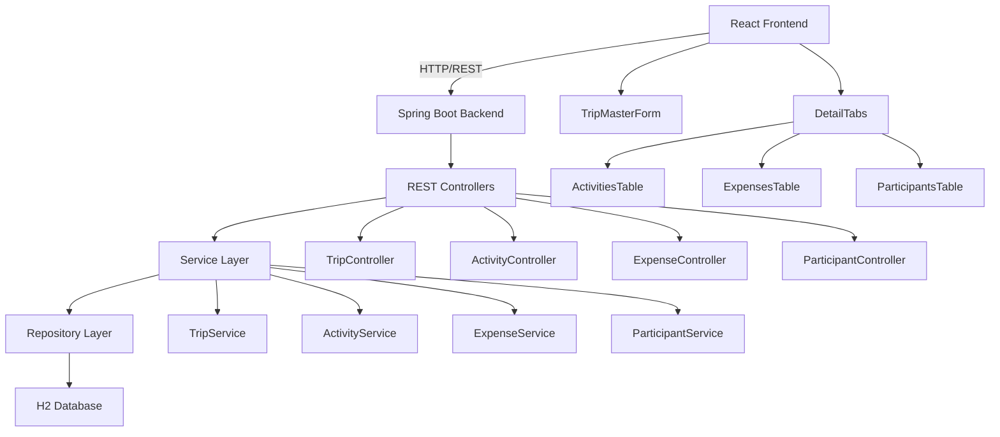
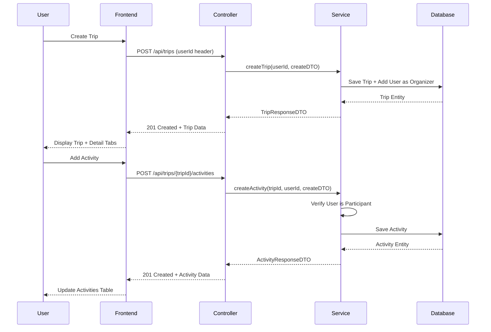

# Design Document: Master-Detail Web Interface for Trip Planner

## Overview

This design document describes a comprehensive master-detail web interface for the Trip Planner application. The interface follows a hierarchical pattern where users manage trips (master) and their related entities - activities, expenses, and participants (details). The backend provides RESTful API endpoints through Spring Boot controllers that delegate to existing service layer implementations. The frontend uses React with TypeScript to create an interactive, responsive user interface with form-based CRUD operations and tabbed detail views.

The system architecture follows a clear separation of concerns: REST controllers handle HTTP concerns (request/response mapping, validation, error handling), services contain business logic and authorization, and the React frontend manages UI state and user interactions. All operations require a userId for authorization, which will be passed as a request header until OAuth authentication is implemented.

## Architecture



## Main Workflow




## Components and Interfaces

### Backend Component 1: TripController

**Purpose**: Handles HTTP requests for trip CRUD operations and delegates to TripService

**Interface**:
```java
@RestController
@RequestMapping("/api/trips")
public class TripController {
    
    @PostMapping
    ResponseEntity<TripResponseDTO> createTrip(
        @RequestHeader("X-User-Id") Integer userId,
        @Valid @RequestBody CreateTripDTO createDTO
    );
    
    @GetMapping("/{tripId}")
    ResponseEntity<TripResponseDTO> getTripById(
        @PathVariable Integer tripId,
        @RequestHeader("X-User-Id") Integer userId
    );
    
    @GetMapping
    ResponseEntity<List<TripResponseDTO>> listUserTrips(
        @RequestHeader("X-User-Id") Integer userId
    );
    
    @PutMapping("/{tripId}")
    ResponseEntity<TripResponseDTO> updateTrip(
        @PathVariable Integer tripId,
        @RequestHeader("X-User-Id") Integer userId,
        @Valid @RequestBody UpdateTripDTO updateDTO
    );
    
    @DeleteMapping("/{tripId}")
    ResponseEntity<Void> deleteTrip(
        @PathVariable Integer tripId,
        @RequestHeader("X-User-Id") Integer userId
    );
}
```

**Responsibilities**:
- Validate incoming request data using Jakarta Validation
- Extract userId from request header
- Map HTTP requests to service method calls
- Handle exceptions and return appropriate HTTP status codes
- Return standardized JSON responses

### Backend Component 2: ActivityController

**Purpose**: Handles HTTP requests for activity CRUD operations within trips

**Interface**:
```java
@RestController
@RequestMapping("/api/trips/{tripId}/activities")
public class ActivityController {
    
    @PostMapping
    ResponseEntity<ActivityResponseDTO> createActivity(
        @PathVariable Integer tripId,
        @RequestHeader("X-User-Id") Integer userId,
        @Valid @RequestBody CreateActivityDTO createDTO
    );
    
    @GetMapping("/{activityId}")
    ResponseEntity<ActivityResponseDTO> getActivityById(
        @PathVariable Integer activityId,
        @RequestHeader("X-User-Id") Integer userId
    );
    
    @GetMapping
    ResponseEntity<List<ActivityResponseDTO>> listTripActivities(
        @PathVariable Integer tripId,
        @RequestHeader("X-User-Id") Integer userId
    );
    
    @PutMapping("/{activityId}")
    ResponseEntity<ActivityResponseDTO> updateActivity(
        @PathVariable Integer activityId,
        @RequestHeader("X-User-Id") Integer userId,
        @Valid @RequestBody UpdateActivityDTO updateDTO
    );
    
    @DeleteMapping("/{activityId}")
    ResponseEntity<Void> deleteActivity(
        @PathVariable Integer activityId,
        @RequestHeader("X-User-Id") Integer userId
    );
}
```

**Responsibilities**:
- Validate activity data including datetime ranges
- Ensure tripId context is maintained
- Delegate authorization checks to service layer
- Handle location and category associations

### Backend Component 3: ExpenseController

**Purpose**: Handles HTTP requests for expense CRUD operations within trips

**Interface**:
```java
@RestController
@RequestMapping("/api/trips/{tripId}/expenses")
public class ExpenseController {
    
    @PostMapping
    ResponseEntity<ExpenseResponseDTO> createExpense(
        @PathVariable Integer tripId,
        @RequestHeader("X-User-Id") Integer userId,
        @Valid @RequestBody CreateExpenseDTO createDTO
    );
    
    @GetMapping("/{expenseId}")
    ResponseEntity<ExpenseResponseDTO> getExpenseById(
        @PathVariable Integer expenseId,
        @RequestHeader("X-User-Id") Integer userId
    );
    
    @GetMapping
    ResponseEntity<List<ExpenseResponseDTO>> listTripExpenses(
        @PathVariable Integer tripId,
        @RequestHeader("X-User-Id") Integer userId
    );
    
    @PutMapping("/{expenseId}")
    ResponseEntity<ExpenseResponseDTO> updateExpense(
        @PathVariable Integer expenseId,
        @RequestHeader("X-User-Id") Integer userId,
        @Valid @RequestBody UpdateExpenseDTO updateDTO
    );
    
    @DeleteMapping("/{expenseId}")
    ResponseEntity<Void> deleteExpense(
        @PathVariable Integer expenseId,
        @RequestHeader("X-User-Id") Integer userId
    );
}
```

**Responsibilities**:
- Validate expense amounts and categories
- Trigger trip total expense recalculation through service
- Handle currency and decimal precision correctly
- Maintain expense-trip relationship integrity

### Backend Component 4: ParticipantController

**Purpose**: Handles HTTP requests for participant management within trips

**Interface**:
```java
@RestController
@RequestMapping("/api/trips/{tripId}/participants")
public class ParticipantController {
    
    @PostMapping
    ResponseEntity<ParticipantResponseDTO> addParticipant(
        @PathVariable Integer tripId,
        @RequestHeader("X-User-Id") Integer organizerId,
        @Valid @RequestBody AddParticipantDTO addDTO
    );
    
    @GetMapping
    ResponseEntity<List<ParticipantResponseDTO>> listTripParticipants(
        @PathVariable Integer tripId,
        @RequestHeader("X-User-Id") Integer userId
    );
    
    @DeleteMapping("/{participantId}")
    ResponseEntity<Void> removeParticipant(
        @PathVariable Integer participantId,
        @RequestHeader("X-User-Id") Integer organizerId
    );
}
```

**Responsibilities**:
- Enforce organizer-only operations for add/remove
- Prevent removal of last organizer
- Handle role-based access control
- Maintain participant-trip associations


### Frontend Component 1: TripMasterForm

**Purpose**: Master form component for creating and editing trips

**Interface**:
```typescript
interface TripMasterFormProps {
  trip?: TripResponseDTO;
  onSave: (trip: TripResponseDTO) => void;
  onCancel: () => void;
}

interface TripFormData {
  naziv: string;
  opis: string;
  datumPoc: string;
  datumKraj: string;
}

const TripMasterForm: React.FC<TripMasterFormProps> = ({ trip, onSave, onCancel }) => {
  // Component implementation
};
```

**Responsibilities**:
- Render form fields for trip name, description, start date, end date
- Validate form data before submission
- Handle create and update modes
- Display validation errors
- Call API endpoints for trip operations
- Emit events on successful save or cancel

### Frontend Component 2: DetailTabsContainer

**Purpose**: Container component managing tabbed detail views

**Interface**:
```typescript
interface DetailTabsContainerProps {
  tripId: number;
  userId: number;
}

type TabType = 'activities' | 'expenses' | 'participants';

const DetailTabsContainer: React.FC<DetailTabsContainerProps> = ({ tripId, userId }) => {
  // Component implementation
};
```

**Responsibilities**:
- Manage active tab state
- Render tab navigation
- Display appropriate detail table based on active tab
- Pass tripId and userId context to child components
- Handle tab switching

### Frontend Component 3: ActivitiesTable

**Purpose**: Display and manage activities for a trip

**Interface**:
```typescript
interface ActivitiesTableProps {
  tripId: number;
  userId: number;
}

const ActivitiesTable: React.FC<ActivitiesTableProps> = ({ tripId, userId }) => {
  // Component implementation
};
```

**Responsibilities**:
- Fetch and display activities list
- Provide add/edit/delete actions
- Show activity details (name, description, datetime range, location)
- Handle activity form modal
- Refresh list after mutations

### Frontend Component 4: ExpensesTable

**Purpose**: Display and manage expenses for a trip

**Interface**:
```typescript
interface ExpensesTableProps {
  tripId: number;
  userId: number;
}

const ExpensesTable: React.FC<ExpensesTableProps> = ({ tripId, userId }) => {
  // Component implementation
};
```

**Responsibilities**:
- Fetch and display expenses list
- Provide add/edit/delete actions
- Show expense details (description, amount, category, date)
- Calculate and display total expenses
- Handle expense form modal
- Refresh list after mutations

### Frontend Component 5: ParticipantsTable

**Purpose**: Display and manage participants for a trip

**Interface**:
```typescript
interface ParticipantsTableProps {
  tripId: number;
  userId: number;
  isOrganizer: boolean;
}

const ParticipantsTable: React.FC<ParticipantsTableProps> = ({ tripId, userId, isOrganizer }) => {
  // Component implementation
};
```

**Responsibilities**:
- Fetch and display participants list
- Show participant details (name, email, role)
- Provide add/remove actions (organizer only)
- Prevent removal of last organizer
- Handle participant selection modal
- Refresh list after mutations


## Data Models

### Trip Model

```typescript
interface TripResponseDTO {
  putovanjeId: number;
  naziv: string;
  opis: string;
  datumPoc: string; // ISO date format
  datumKraj: string; // ISO date format
  ukTrosak: number;
  participantCount: number;
}

interface CreateTripDTO {
  naziv: string;
  opis?: string;
  datumPoc: string;
  datumKraj: string;
}

interface UpdateTripDTO {
  naziv?: string;
  opis?: string;
  datumPoc?: string;
  datumKraj?: string;
}
```

**Validation Rules**:
- naziv: Required, non-blank
- datumPoc: Required, valid date
- datumKraj: Required, valid date, must be >= datumPoc
- opis: Optional

### Activity Model

```typescript
interface ActivityResponseDTO {
  aktivnostId: number;
  naziv: string;
  opis: string;
  datumVrijemePoc: string; // ISO datetime format
  datumVrijemeKraj: string; // ISO datetime format
  location: LocationResponseDTO;
  categories: CategoryResponseDTO[];
}

interface CreateActivityDTO {
  naziv: string;
  opis?: string;
  datumVrijemePoc: string;
  datumVrijemeKraj: string;
  lokacijaId: number;
  categoryIds?: number[];
}

interface UpdateActivityDTO {
  naziv?: string;
  opis?: string;
  datumVrijemePoc?: string;
  datumVrijemeKraj?: string;
  lokacijaId?: number;
  categoryIds?: number[];
}
```

**Validation Rules**:
- naziv: Required, non-blank
- datumVrijemePoc: Required, valid datetime
- datumVrijemeKraj: Required, valid datetime, must be >= datumVrijemePoc
- lokacijaId: Required, must reference existing location
- categoryIds: Optional, must reference existing categories

### Expense Model

```typescript
interface ExpenseResponseDTO {
  trosak_id: number;
  opis: string;
  iznos: number;
  datum: string; // ISO date format
  category: CategoryResponseDTO;
  paidBy: UserResponseDTO;
}

interface CreateExpenseDTO {
  opis: string;
  iznos: number;
  datum: string;
  kategorijaId: number;
}

interface UpdateExpenseDTO {
  opis?: string;
  iznos?: number;
  datum?: string;
  kategorijaId?: number;
}
```

**Validation Rules**:
- opis: Required, non-blank
- iznos: Required, positive number with 2 decimal places
- datum: Required, valid date
- kategorijaId: Required, must reference existing category

### Participant Model

```typescript
interface ParticipantResponseDTO {
  sudjelovanjeId: number;
  user: UserResponseDTO;
  uloga: 'ORGANIZER' | 'PARTICIPANT';
  datumPridruživanja: string; // ISO date format
}

interface AddParticipantDTO {
  korisnikId: number;
  uloga: 'ORGANIZER' | 'PARTICIPANT';
}
```

**Validation Rules**:
- korisnikId: Required, must reference existing user
- uloga: Required, must be valid role enum
- Cannot remove last organizer from trip


## Algorithmic Pseudocode

### Backend: Controller Error Handling Algorithm

```pascal
ALGORITHM handleControllerRequest(request, serviceMethod)
INPUT: request (HTTP request with headers and body)
       serviceMethod (service layer method to invoke)
OUTPUT: ResponseEntity with appropriate status code and body

BEGIN
  TRY
    // Extract userId from header
    userId ← request.getHeader("X-User-Id")
    
    IF userId IS NULL THEN
      RETURN ResponseEntity.status(400).body("Missing X-User-Id header")
    END IF
    
    // Validate request body if present
    IF request.hasBody() THEN
      validationErrors ← validateRequestBody(request.body)
      IF validationErrors IS NOT EMPTY THEN
        RETURN ResponseEntity.status(400).body(validationErrors)
      END IF
    END IF
    
    // Invoke service method
    result ← serviceMethod(userId, request.parameters)
    
    // Determine response status
    IF request.method = "POST" THEN
      RETURN ResponseEntity.status(201).body(result)
    ELSE IF request.method = "DELETE" THEN
      RETURN ResponseEntity.status(204).build()
    ELSE
      RETURN ResponseEntity.status(200).body(result)
    END IF
    
  CATCH IllegalArgumentException AS e
    RETURN ResponseEntity.status(400).body(createErrorResponse(e.message))
    
  CATCH RuntimeException AS e WHERE e.message CONTAINS "not found"
    RETURN ResponseEntity.status(404).body(createErrorResponse(e.message))
    
  CATCH RuntimeException AS e WHERE e.message CONTAINS "not authorized" OR "not a participant" OR "not an organizer"
    RETURN ResponseEntity.status(403).body(createErrorResponse(e.message))
    
  CATCH Exception AS e
    logError(e)
    RETURN ResponseEntity.status(500).body(createErrorResponse("Internal server error"))
  END TRY
END
```

**Preconditions:**
- request is a valid HTTP request object
- serviceMethod is a valid callable service method

**Postconditions:**
- Returns ResponseEntity with appropriate HTTP status code
- Error responses include descriptive error messages
- All exceptions are caught and converted to HTTP responses

**Loop Invariants:** N/A (no loops in this algorithm)

### Frontend: Form Submission Algorithm

```pascal
ALGORITHM submitTripForm(formData, isEditMode, tripId)
INPUT: formData (trip form fields)
       isEditMode (boolean indicating create vs update)
       tripId (optional, required for edit mode)
OUTPUT: success (boolean) and savedTrip (TripResponseDTO or null)

BEGIN
  // Validate form data
  errors ← EMPTY_LIST
  
  IF formData.naziv IS EMPTY THEN
    errors.add("Trip name is required")
  END IF
  
  IF formData.datumPoc IS EMPTY THEN
    errors.add("Start date is required")
  END IF
  
  IF formData.datumKraj IS EMPTY THEN
    errors.add("End date is required")
  END IF
  
  IF formData.datumPoc > formData.datumKraj THEN
    errors.add("End date must be after start date")
  END IF
  
  IF errors IS NOT EMPTY THEN
    displayErrors(errors)
    RETURN (false, null)
  END IF
  
  // Prepare API request
  userId ← getCurrentUserId()
  headers ← {"X-User-Id": userId, "Content-Type": "application/json"}
  
  TRY
    IF isEditMode THEN
      // Update existing trip
      url ← "/api/trips/" + tripId
      response ← httpClient.put(url, formData, headers)
    ELSE
      // Create new trip
      url ← "/api/trips"
      response ← httpClient.post(url, formData, headers)
    END IF
    
    IF response.status = 200 OR response.status = 201 THEN
      savedTrip ← response.body
      displaySuccessMessage("Trip saved successfully")
      RETURN (true, savedTrip)
    ELSE
      displayError("Failed to save trip: " + response.body.message)
      RETURN (false, null)
    END IF
    
  CATCH NetworkError AS e
    displayError("Network error: Unable to connect to server")
    RETURN (false, null)
    
  CATCH Exception AS e
    displayError("Unexpected error: " + e.message)
    RETURN (false, null)
  END TRY
END
```

**Preconditions:**
- formData contains all required trip fields
- If isEditMode is true, tripId must be provided
- User is authenticated and userId is available

**Postconditions:**
- Returns success status and saved trip data if successful
- Displays appropriate error messages on failure
- Form validation errors are shown to user
- Network errors are handled gracefully

**Loop Invariants:** N/A (no loops in this algorithm)

### Frontend: Detail Table Data Loading Algorithm

```pascal
ALGORITHM loadDetailTableData(tripId, userId, entityType)
INPUT: tripId (ID of the trip)
       userId (ID of the current user)
       entityType (one of: "activities", "expenses", "participants")
OUTPUT: entityList (array of entities) or error

BEGIN
  // Set loading state
  setLoading(true)
  setError(null)
  
  // Determine API endpoint
  IF entityType = "activities" THEN
    url ← "/api/trips/" + tripId + "/activities"
  ELSE IF entityType = "expenses" THEN
    url ← "/api/trips/" + tripId + "/expenses"
  ELSE IF entityType = "participants" THEN
    url ← "/api/trips/" + tripId + "/participants"
  ELSE
    setError("Invalid entity type")
    setLoading(false)
    RETURN null
  END IF
  
  // Prepare request headers
  headers ← {"X-User-Id": userId}
  
  TRY
    // Fetch data from API
    response ← httpClient.get(url, headers)
    
    IF response.status = 200 THEN
      entityList ← response.body
      setData(entityList)
      setLoading(false)
      RETURN entityList
      
    ELSE IF response.status = 403 THEN
      setError("You do not have permission to view this data")
      setLoading(false)
      RETURN null
      
    ELSE IF response.status = 404 THEN
      setError("Trip not found")
      setLoading(false)
      RETURN null
      
    ELSE
      setError("Failed to load data: " + response.body.message)
      setLoading(false)
      RETURN null
    END IF
    
  CATCH NetworkError AS e
    setError("Network error: Unable to connect to server")
    setLoading(false)
    RETURN null
    
  CATCH Exception AS e
    setError("Unexpected error: " + e.message)
    setLoading(false)
    RETURN null
  END TRY
END
```

**Preconditions:**
- tripId is a valid trip identifier
- userId is a valid user identifier
- entityType is one of the supported types
- User has permission to access the trip

**Postconditions:**
- Returns array of entities if successful
- Sets loading state appropriately
- Displays error messages on failure
- Handles authorization and not-found errors

**Loop Invariants:** N/A (no loops in this algorithm)


## Key Functions with Formal Specifications

### Backend Function: TripController.createTrip()

```java
@PostMapping
public ResponseEntity<TripResponseDTO> createTrip(
    @RequestHeader("X-User-Id") Integer userId,
    @Valid @RequestBody CreateTripDTO createDTO
) {
    TripResponseDTO trip = tripService.createTrip(userId, createDTO);
    return ResponseEntity.status(HttpStatus.CREATED).body(trip);
}
```

**Preconditions:**
- userId is non-null and references an existing user
- createDTO is non-null and passes Jakarta validation
- createDTO.naziv is non-blank
- createDTO.datumPoc and createDTO.datumKraj are non-null
- createDTO.datumKraj >= createDTO.datumPoc

**Postconditions:**
- Returns HTTP 201 Created status
- Response body contains TripResponseDTO with generated putovanjeId
- Trip is persisted in database
- Creating user is automatically added as organizer
- If validation fails, returns HTTP 400 with error details
- If service throws exception, returns appropriate error status

**Loop Invariants:** N/A

### Backend Function: ActivityController.listTripActivities()

```java
@GetMapping
public ResponseEntity<List<ActivityResponseDTO>> listTripActivities(
    @PathVariable Integer tripId,
    @RequestHeader("X-User-Id") Integer userId
) {
    List<ActivityResponseDTO> activities = activityService.listTripActivities(tripId, userId);
    return ResponseEntity.ok(activities);
}
```

**Preconditions:**
- tripId is non-null and references an existing trip
- userId is non-null and references an existing user
- User is a participant of the trip

**Postconditions:**
- Returns HTTP 200 OK status
- Response body contains list of ActivityResponseDTO ordered by start datetime
- If user is not a participant, returns HTTP 403 Forbidden
- If trip not found, returns HTTP 404 Not Found
- Empty list returned if trip has no activities

**Loop Invariants:** N/A

### Frontend Function: submitTripForm()

```typescript
async function submitTripForm(
  formData: TripFormData,
  isEditMode: boolean,
  tripId?: number
): Promise<{ success: boolean; trip: TripResponseDTO | null }> {
  // Validate form
  const errors = validateTripForm(formData);
  if (errors.length > 0) {
    displayErrors(errors);
    return { success: false, trip: null };
  }
  
  // Submit to API
  const userId = getCurrentUserId();
  const url = isEditMode ? `/api/trips/${tripId}` : '/api/trips';
  const method = isEditMode ? 'PUT' : 'POST';
  
  try {
    const response = await fetch(url, {
      method,
      headers: {
        'Content-Type': 'application/json',
        'X-User-Id': userId.toString()
      },
      body: JSON.stringify(formData)
    });
    
    if (response.ok) {
      const trip = await response.json();
      return { success: true, trip };
    } else {
      const error = await response.json();
      displayError(error.message);
      return { success: false, trip: null };
    }
  } catch (error) {
    displayError('Network error');
    return { success: false, trip: null };
  }
}
```

**Preconditions:**
- formData contains all required fields
- If isEditMode is true, tripId must be provided and valid
- User is authenticated and userId is available
- Network connection is available

**Postconditions:**
- Returns object with success status and trip data
- If successful, trip data is returned and success is true
- If validation fails, errors are displayed and success is false
- If network error occurs, error message is displayed and success is false
- Form data is not modified

**Loop Invariants:** N/A

### Frontend Function: deleteEntity()

```typescript
async function deleteEntity(
  entityType: 'trip' | 'activity' | 'expense' | 'participant',
  entityId: number,
  tripId?: number
): Promise<boolean> {
  // Confirm deletion
  const confirmed = await confirmDialog(`Delete this ${entityType}?`);
  if (!confirmed) {
    return false;
  }
  
  // Build URL
  let url: string;
  if (entityType === 'trip') {
    url = `/api/trips/${entityId}`;
  } else if (entityType === 'activity') {
    url = `/api/trips/${tripId}/activities/${entityId}`;
  } else if (entityType === 'expense') {
    url = `/api/trips/${tripId}/expenses/${entityId}`;
  } else {
    url = `/api/trips/${tripId}/participants/${entityId}`;
  }
  
  const userId = getCurrentUserId();
  
  try {
    const response = await fetch(url, {
      method: 'DELETE',
      headers: {
        'X-User-Id': userId.toString()
      }
    });
    
    if (response.ok) {
      displaySuccess(`${entityType} deleted successfully`);
      return true;
    } else {
      const error = await response.json();
      displayError(error.message);
      return false;
    }
  } catch (error) {
    displayError('Network error');
    return false;
  }
}
```

**Preconditions:**
- entityType is one of the valid types
- entityId is non-null and references an existing entity
- If entityType is not 'trip', tripId must be provided
- User has permission to delete the entity
- User confirms deletion

**Postconditions:**
- Returns true if deletion successful, false otherwise
- Entity is removed from database if successful
- Success/error message is displayed to user
- If user cancels confirmation, returns false without API call
- If authorization fails, returns false and displays error

**Loop Invariants:** N/A


## Example Usage

### Backend: Creating a Trip via REST API

```bash
# Create a new trip
curl -X POST http://localhost:8080/api/trips \
  -H "Content-Type: application/json" \
  -H "X-User-Id: 1" \
  -d '{
    "naziv": "Summer Vacation 2024",
    "opis": "Beach trip with friends",
    "datumPoc": "2024-07-01",
    "datumKraj": "2024-07-15"
  }'

# Response: 201 Created
{
  "putovanjeId": 1,
  "naziv": "Summer Vacation 2024",
  "opis": "Beach trip with friends",
  "datumPoc": "2024-07-01",
  "datumKraj": "2024-07-15",
  "ukTrosak": 0.00,
  "participantCount": 1
}
```

### Backend: Adding an Activity to a Trip

```bash
# Add activity to trip
curl -X POST http://localhost:8080/api/trips/1/activities \
  -H "Content-Type: application/json" \
  -H "X-User-Id: 1" \
  -d '{
    "naziv": "Beach Day",
    "opis": "Relaxing at the beach",
    "datumVrijemePoc": "2024-07-02T10:00:00",
    "datumVrijemeKraj": "2024-07-02T18:00:00",
    "lokacijaId": 5,
    "categoryIds": [1, 3]
  }'

# Response: 201 Created
{
  "aktivnostId": 1,
  "naziv": "Beach Day",
  "opis": "Relaxing at the beach",
  "datumVrijemePoc": "2024-07-02T10:00:00",
  "datumVrijemeKraj": "2024-07-02T18:00:00",
  "location": {
    "lokacijaId": 5,
    "naziv": "Sunny Beach",
    "adresa": "123 Beach Road"
  },
  "categories": [
    {"kategorijaId": 1, "naziv": "Leisure"},
    {"kategorijaId": 3, "naziv": "Outdoor"}
  ]
}
```

### Frontend: Complete Trip Management Workflow

```typescript
// 1. Load user's trips on component mount
useEffect(() => {
  async function loadTrips() {
    const userId = getCurrentUserId();
    const response = await fetch('/api/trips', {
      headers: { 'X-User-Id': userId.toString() }
    });
    const trips = await response.json();
    setTrips(trips);
  }
  loadTrips();
}, []);

// 2. Create new trip
async function handleCreateTrip(formData: TripFormData) {
  const result = await submitTripForm(formData, false);
  if (result.success) {
    setSelectedTrip(result.trip);
    setTrips([...trips, result.trip]);
  }
}

// 3. Select trip and load details
async function handleSelectTrip(tripId: number) {
  const userId = getCurrentUserId();
  
  // Load trip details
  const tripResponse = await fetch(`/api/trips/${tripId}`, {
    headers: { 'X-User-Id': userId.toString() }
  });
  const trip = await tripResponse.json();
  setSelectedTrip(trip);
  
  // Load activities
  const activitiesResponse = await fetch(`/api/trips/${tripId}/activities`, {
    headers: { 'X-User-Id': userId.toString() }
  });
  const activities = await activitiesResponse.json();
  setActivities(activities);
  
  // Load expenses
  const expensesResponse = await fetch(`/api/trips/${tripId}/expenses`, {
    headers: { 'X-User-Id': userId.toString() }
  });
  const expenses = await expensesResponse.json();
  setExpenses(expenses);
  
  // Load participants
  const participantsResponse = await fetch(`/api/trips/${tripId}/participants`, {
    headers: { 'X-User-Id': userId.toString() }
  });
  const participants = await participantsResponse.json();
  setParticipants(participants);
}

// 4. Add activity to selected trip
async function handleAddActivity(activityData: CreateActivityDTO) {
  const userId = getCurrentUserId();
  const response = await fetch(`/api/trips/${selectedTrip.putovanjeId}/activities`, {
    method: 'POST',
    headers: {
      'Content-Type': 'application/json',
      'X-User-Id': userId.toString()
    },
    body: JSON.stringify(activityData)
  });
  
  if (response.ok) {
    const newActivity = await response.json();
    setActivities([...activities, newActivity]);
    displaySuccess('Activity added successfully');
  }
}

// 5. Delete expense
async function handleDeleteExpense(expenseId: number) {
  const success = await deleteEntity('expense', expenseId, selectedTrip.putovanjeId);
  if (success) {
    setExpenses(expenses.filter(e => e.trosak_id !== expenseId));
    // Reload trip to get updated total expense
    handleSelectTrip(selectedTrip.putovanjeId);
  }
}
```

### Frontend: Master-Detail UI Component Structure

```typescript
function TripPlannerApp() {
  const [trips, setTrips] = useState<TripResponseDTO[]>([]);
  const [selectedTrip, setSelectedTrip] = useState<TripResponseDTO | null>(null);
  const [activeTab, setActiveTab] = useState<TabType>('activities');
  const userId = getCurrentUserId();
  
  return (
    <div className="trip-planner-container">
      {/* Master Section */}
      <div className="master-section">
        <h1>Trip Planner</h1>
        
        {/* Trip List */}
        <div className="trip-list">
          {trips.map(trip => (
            <TripCard
              key={trip.putovanjeId}
              trip={trip}
              isSelected={selectedTrip?.putovanjeId === trip.putovanjeId}
              onClick={() => handleSelectTrip(trip.putovanjeId)}
            />
          ))}
        </div>
        
        {/* Trip Form */}
        <TripMasterForm
          trip={selectedTrip}
          onSave={handleSaveTrip}
          onCancel={handleCancelEdit}
        />
      </div>
      
      {/* Detail Section */}
      {selectedTrip && (
        <div className="detail-section">
          <h2>{selectedTrip.naziv}</h2>
          
          {/* Tab Navigation */}
          <div className="tab-navigation">
            <button
              className={activeTab === 'activities' ? 'active' : ''}
              onClick={() => setActiveTab('activities')}
            >
              Activities
            </button>
            <button
              className={activeTab === 'expenses' ? 'active' : ''}
              onClick={() => setActiveTab('expenses')}
            >
              Expenses
            </button>
            <button
              className={activeTab === 'participants' ? 'active' : ''}
              onClick={() => setActiveTab('participants')}
            >
              Participants
            </button>
          </div>
          
          {/* Tab Content */}
          <div className="tab-content">
            {activeTab === 'activities' && (
              <ActivitiesTable
                tripId={selectedTrip.putovanjeId}
                userId={userId}
              />
            )}
            {activeTab === 'expenses' && (
              <ExpensesTable
                tripId={selectedTrip.putovanjeId}
                userId={userId}
              />
            )}
            {activeTab === 'participants' && (
              <ParticipantsTable
                tripId={selectedTrip.putovanjeId}
                userId={userId}
                isOrganizer={checkIfOrganizer(selectedTrip, userId)}
              />
            )}
          </div>
        </div>
      )}
    </div>
  );
}
```


## Correctness Properties

### Property 1: Authorization Enforcement

**Universal Quantification:**
```
∀ request ∈ APIRequests, ∀ user ∈ Users, ∀ trip ∈ Trips:
  (request.operation ∈ {READ, UPDATE, DELETE} ∧ request.target = trip)
  ⟹ isParticipant(user, trip) ∨ response.status = 403
```

**Description:** All trip-related operations require the user to be a participant of the trip. If the user is not a participant, the system returns HTTP 403 Forbidden.

**Test Approach:** Property-based test generating random users, trips, and operations, verifying authorization checks.

### Property 2: Organizer-Only Operations

**Universal Quantification:**
```
∀ request ∈ APIRequests, ∀ user ∈ Users, ∀ trip ∈ Trips:
  (request.operation ∈ {UPDATE_TRIP, DELETE_TRIP, ADD_PARTICIPANT, REMOVE_PARTICIPANT} ∧ request.target = trip)
  ⟹ isOrganizer(user, trip) ∨ response.status = 403
```

**Description:** Certain operations (trip updates, deletions, participant management) require organizer role. Non-organizers receive HTTP 403 Forbidden.

**Test Approach:** Property-based test with role-based scenarios, verifying organizer-only operations are protected.

### Property 3: Date Range Validity

**Universal Quantification:**
```
∀ trip ∈ Trips:
  trip.datumKraj ≥ trip.datumPoc

∀ activity ∈ Activities:
  activity.datumVrijemeKraj ≥ activity.datumVrijemePoc
```

**Description:** End dates/times must always be greater than or equal to start dates/times for both trips and activities.

**Test Approach:** Property-based test generating random date ranges, verifying validation rejects invalid ranges.

### Property 4: Expense Total Consistency

**Universal Quantification:**
```
∀ trip ∈ Trips:
  trip.ukTrosak = Σ(expense.iznos | expense ∈ trip.expenses)
```

**Description:** The trip's total expense must always equal the sum of all individual expenses associated with that trip.

**Test Approach:** Property-based test creating/updating/deleting expenses, verifying trip total is recalculated correctly.

### Property 5: Last Organizer Protection

**Universal Quantification:**
```
∀ trip ∈ Trips, ∀ participant ∈ trip.participants:
  (participant.uloga = ORGANIZER ∧ |{p ∈ trip.participants | p.uloga = ORGANIZER}| = 1)
  ⟹ ¬canRemove(participant)
```

**Description:** The last remaining organizer of a trip cannot be removed. There must always be at least one organizer.

**Test Approach:** Property-based test attempting to remove organizers, verifying last organizer removal is prevented.

### Property 6: Cascade Deletion

**Universal Quantification:**
```
∀ trip ∈ Trips:
  delete(trip) ⟹ 
    (∀ activity ∈ trip.activities: ¬exists(activity)) ∧
    (∀ expense ∈ trip.expenses: ¬exists(expense)) ∧
    (∀ participant ∈ trip.participants: ¬exists(participant))
```

**Description:** When a trip is deleted, all associated activities, expenses, and participants are also deleted (cascade).

**Test Approach:** Property-based test creating trips with related entities, verifying all are deleted when trip is deleted.

### Property 7: Participant Count Accuracy

**Universal Quantification:**
```
∀ trip ∈ Trips:
  trip.participantCount = |{p ∈ Participants | p.trip = trip}|
```

**Description:** The participant count field on a trip must always match the actual number of participant records.

**Test Approach:** Property-based test adding/removing participants, verifying count is updated correctly.

### Property 8: Idempotent GET Requests

**Universal Quantification:**
```
∀ request ∈ GETRequests, ∀ state ∈ SystemStates:
  execute(request, state) ⟹ state' = state
```

**Description:** GET requests (list, retrieve) do not modify system state. Multiple identical GET requests return the same result.

**Test Approach:** Property-based test executing GET requests multiple times, verifying no state changes occur.

### Property 9: Validation Before Persistence

**Universal Quantification:**
```
∀ entity ∈ {Trips, Activities, Expenses, Participants}, ∀ data ∈ InputData:
  ¬isValid(data) ⟹ ¬exists(entity) ∧ response.status = 400
```

**Description:** Invalid data is rejected before persistence. No entity is created or updated with invalid data.

**Test Approach:** Property-based test generating invalid data, verifying validation errors prevent persistence.

### Property 10: Response Data Completeness

**Universal Quantification:**
```
∀ entity ∈ {Trips, Activities, Expenses, Participants}:
  response.body.contains(entity) ⟹ 
    (∀ field ∈ entity.requiredFields: response.body.entity.field ≠ null)
```

**Description:** All response DTOs contain complete data with no null values for required fields.

**Test Approach:** Property-based test verifying all API responses have complete, non-null required fields.

