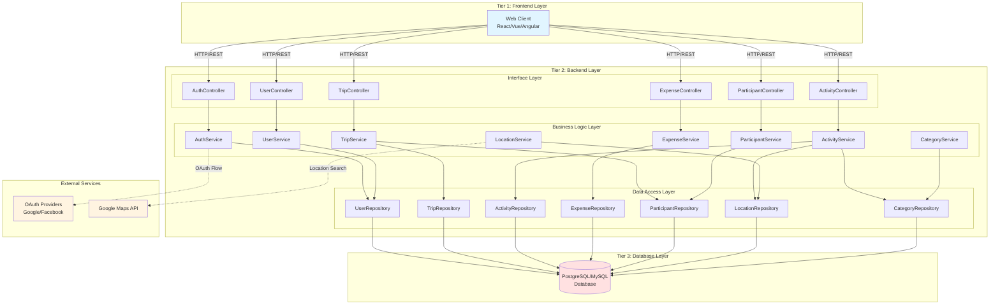
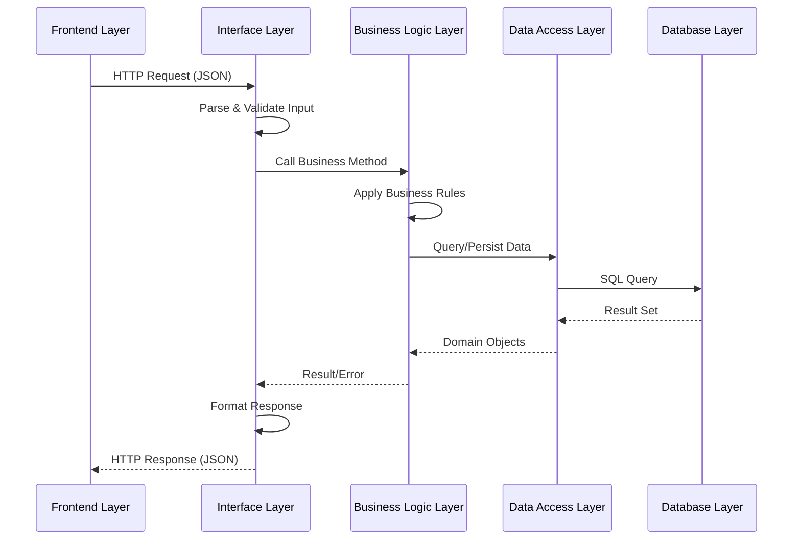
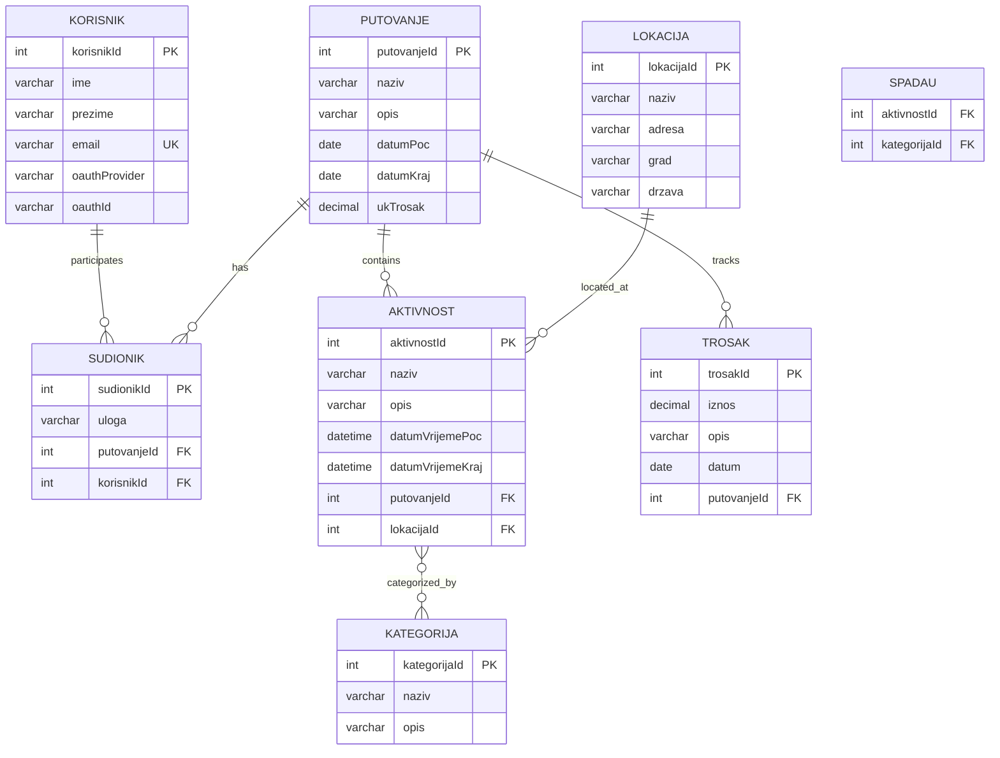
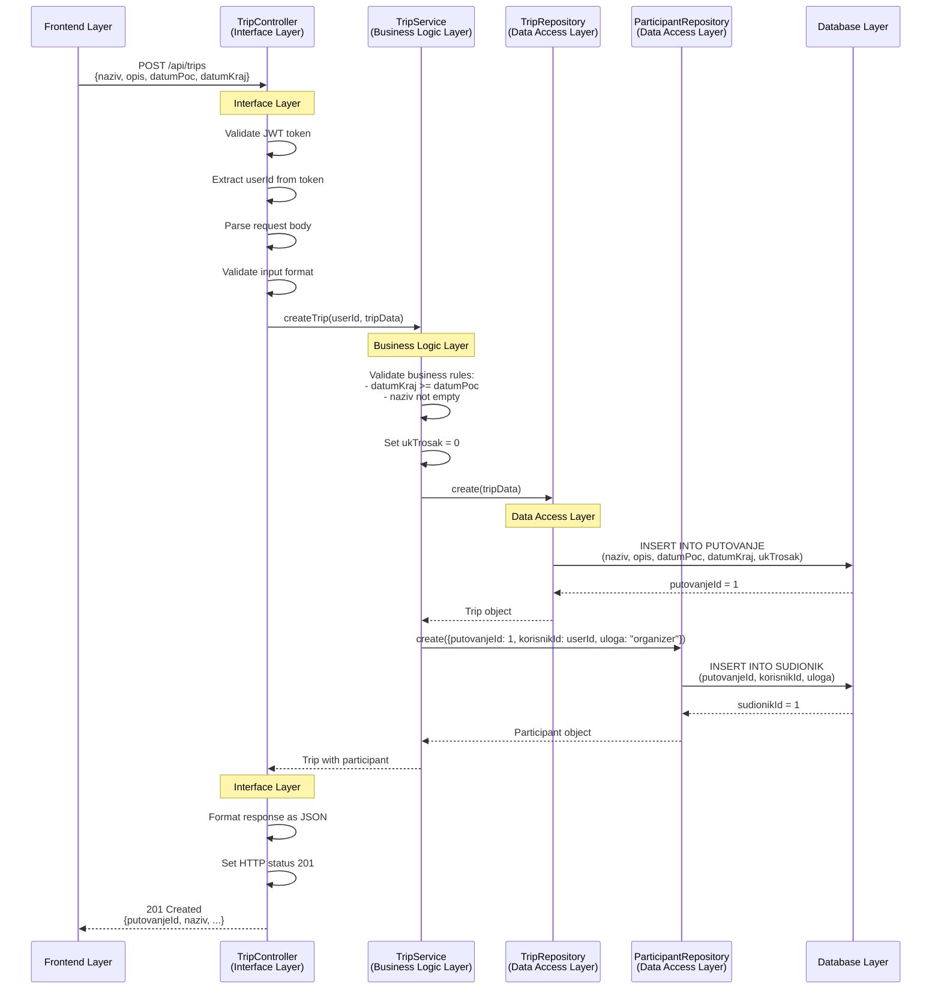
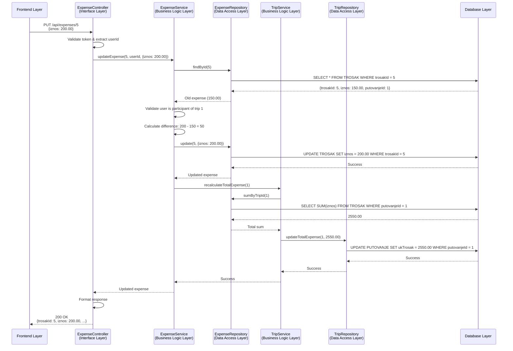
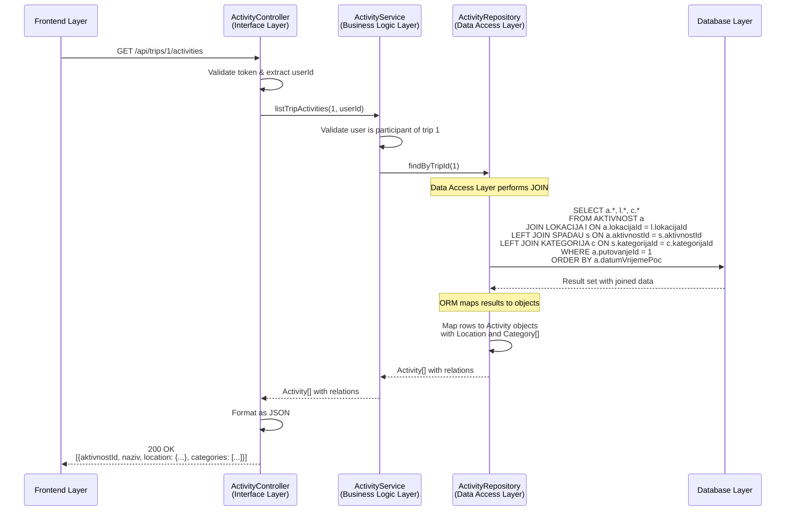
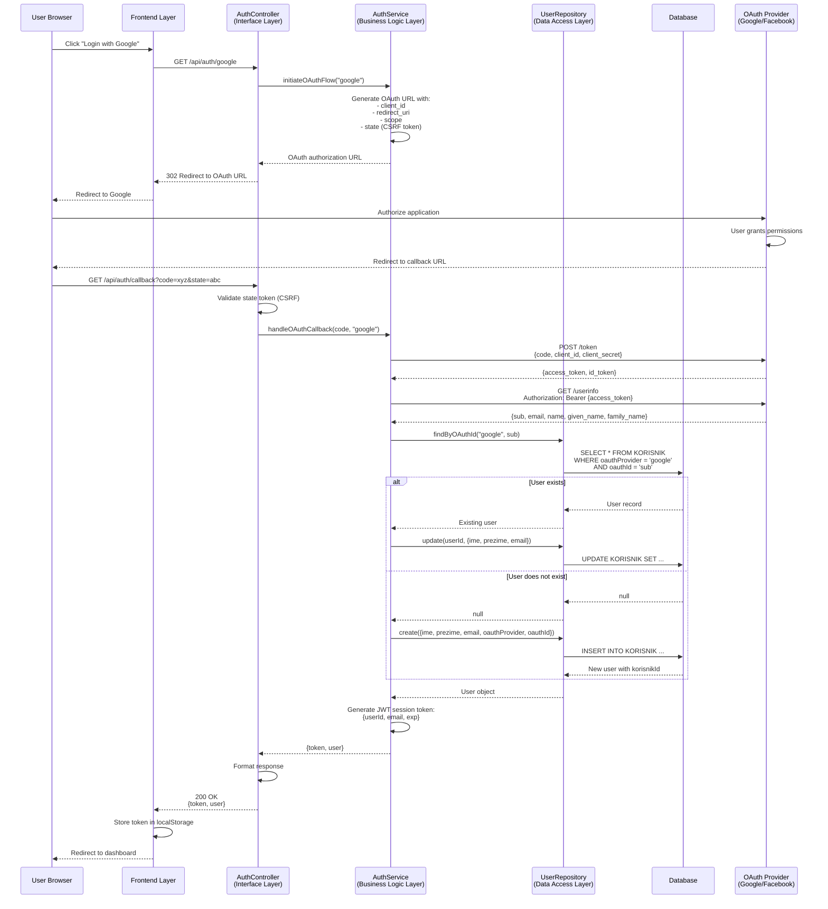
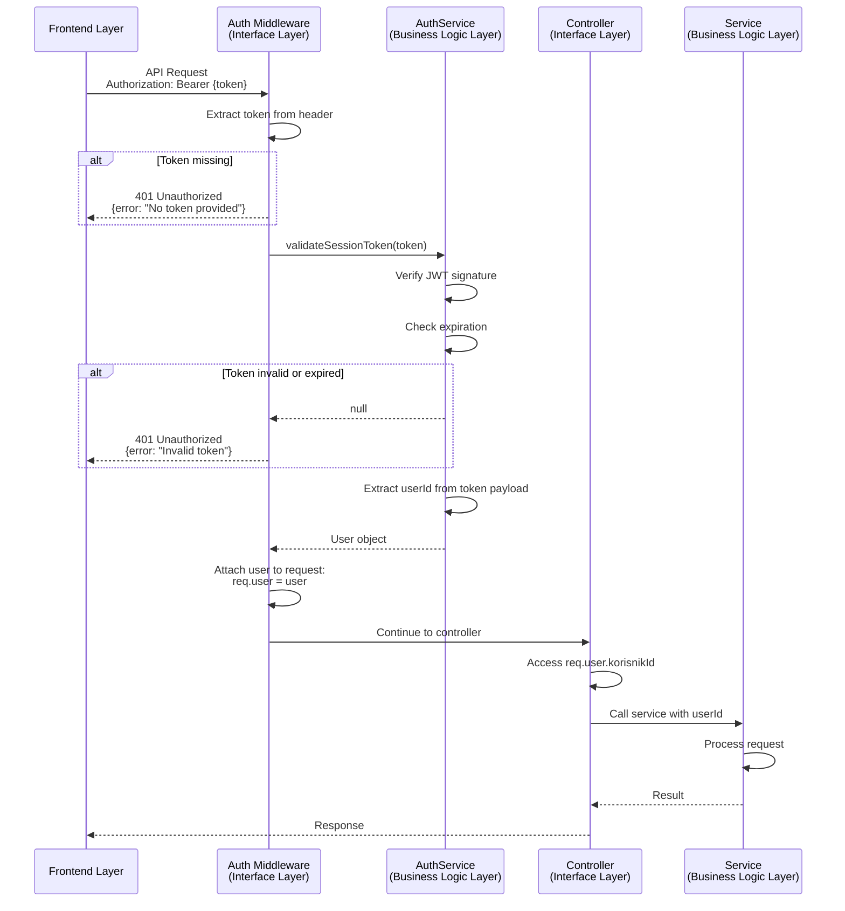
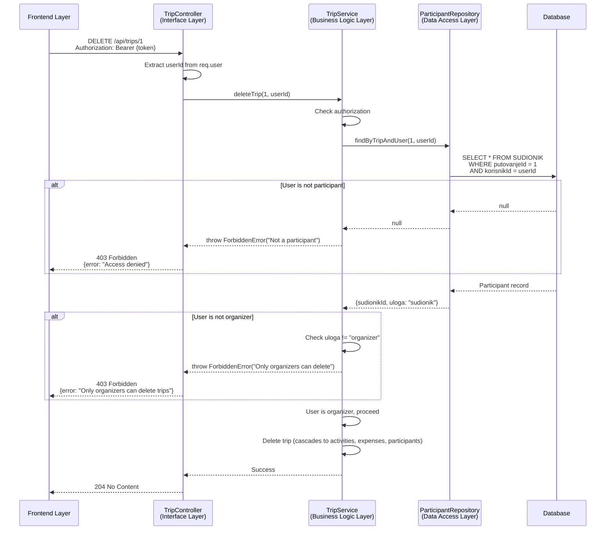
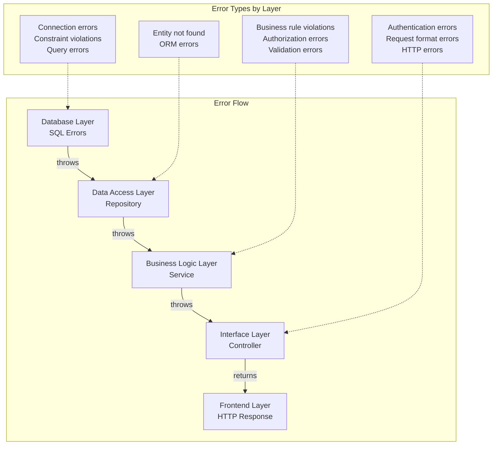

# Design Document: Trip Planner Application

## Overview

The Trip Planner is a web-based travel planning application built on a **3-tier architecture** with a **3-layer backend** structure. The system enables users to create, manage, and organize travel plans with activities, expenses, and participants through OAuth authentication and Google Maps integration.

### System Architecture

The application follows a strict layered architecture pattern with clear separation of concerns:

**Tier 1: Frontend Layer (Presentation Tier)**
- Web client built with modern JavaScript framework (React/Vue/Angular)
- Responsible for user interface rendering and user interaction
- Communicates with backend exclusively through REST API

**Tier 2: Backend Layer (Application Tier)**
- **Interface/Controller Layer**: Handles HTTP requests, routing, and response formatting
- **Business Logic Layer**: Contains domain logic, business rules, and validation
- **Data Access Layer**: Manages database operations and ORM queries

**Tier 3: Database Layer (Data Tier)**
- Relational SQL database (PostgreSQL/MySQL)
- Stores all application data with referential integrity

### Key Design Principles

1. **Separation of Concerns**: Each layer has a single, well-defined responsibility
2. **Strict Layering**: Layers only communicate with adjacent layers (no layer skipping)
3. **Dependency Direction**: Upper layers depend on lower layers, never the reverse
4. **RESTful API**: Standard HTTP methods and status codes for client-server communication
5. **OAuth Security**: External authentication providers for secure user access
6. **Data Integrity**: Database constraints and cascading operations maintain consistency

## Architecture

### High-Level Architecture Diagram



### Layer Communication Flow




## Technology Stack

### Frontend Layer
- **Framework**: React 18+ / Vue 3+ / Angular 15+
- **State Management**: Redux/Vuex/NgRx
- **HTTP Client**: Axios / Fetch API
- **UI Components**: Material-UI / Vuetify / Angular Material
- **Build Tool**: Vite / Webpack
- **Language**: TypeScript

### Backend Layer - Interface Layer
- **Framework**: Express.js (Node.js) / Spring Boot (Java) / ASP.NET Core (C#)
- **Routing**: Express Router / Spring MVC / ASP.NET Routing
- **Validation**: Joi / Hibernate Validator / FluentValidation
- **Authentication Middleware**: Passport.js / Spring Security / ASP.NET Identity
- **Language**: TypeScript/JavaScript / Java / C#

### Backend Layer - Business Logic Layer
- **Design Pattern**: Service Layer Pattern
- **Validation**: Business rule validation logic
- **Transaction Management**: Service-level transaction boundaries
- **Error Handling**: Custom business exceptions
- **Language**: TypeScript/JavaScript / Java / C#

### Backend Layer - Data Access Layer
- **ORM**: TypeORM / Sequelize (Node.js) / Hibernate (Java) / Entity Framework Core (C#)
- **Query Builder**: ORM query methods
- **Connection Pooling**: Built-in ORM connection management
- **Migrations**: ORM migration tools
- **Language**: TypeScript/JavaScript / Java / C#

### Database Layer
- **Database**: PostgreSQL 14+ / MySQL 8+
- **Schema Management**: ORM migrations
- **Backup**: Database-native backup tools

### External Services
- **OAuth Providers**: Google OAuth 2.0, Facebook Login
- **Maps Service**: Google Maps API (Places, Geocoding)

### Development Tools
- **Version Control**: Git
- **API Testing**: Postman / Insomnia
- **Database Client**: pgAdmin / MySQL Workbench / DBeaver
- **Linting**: ESLint / Checkstyle / StyleCop
- **Testing**: Jest / JUnit / xUnit


## Components and Interfaces

### Interface Layer (Controllers)

The Interface Layer handles HTTP communication, request parsing, response formatting, and delegates business operations to the Business Logic Layer.

#### AuthController

**Responsibility**: Handle OAuth authentication flow and session management

**Endpoints**:
- `GET /api/auth/google` - Initiate Google OAuth flow
- `GET /api/auth/facebook` - Initiate Facebook OAuth flow
- `GET /api/auth/callback` - Handle OAuth provider callback
- `POST /api/auth/logout` - Terminate user session

**Methods**:
```typescript
class AuthController {
  initiateGoogleAuth(req, res): void
  initiateFacebookAuth(req, res): void
  handleOAuthCallback(req, res): Promise<void>
  logout(req, res): void
}
```

**Dependencies**: AuthService

---

#### UserController

**Responsibility**: Handle user profile operations

**Endpoints**:
- `GET /api/users/profile` - Get current user profile
- `PUT /api/users/profile` - Update user profile

**Methods**:
```typescript
class UserController {
  getProfile(req, res): Promise<void>
  updateProfile(req, res): Promise<void>
}
```

**Dependencies**: UserService

---

#### TripController

**Responsibility**: Handle trip CRUD operations

**Endpoints**:
- `GET /api/trips` - List all trips for authenticated user
- `GET /api/trips/:id` - Get trip details
- `POST /api/trips` - Create new trip
- `PUT /api/trips/:id` - Update trip
- `DELETE /api/trips/:id` - Delete trip

**Methods**:
```typescript
class TripController {
  listTrips(req, res): Promise<void>
  getTripById(req, res): Promise<void>
  createTrip(req, res): Promise<void>
  updateTrip(req, res): Promise<void>
  deleteTrip(req, res): Promise<void>
}
```

**Dependencies**: TripService

---

#### ActivityController

**Responsibility**: Handle activity CRUD operations within trips

**Endpoints**:
- `GET /api/trips/:tripId/activities` - List activities for a trip
- `GET /api/activities/:id` - Get activity details
- `POST /api/trips/:tripId/activities` - Create new activity
- `PUT /api/activities/:id` - Update activity
- `DELETE /api/activities/:id` - Delete activity

**Methods**:
```typescript
class ActivityController {
  listActivities(req, res): Promise<void>
  getActivityById(req, res): Promise<void>
  createActivity(req, res): Promise<void>
  updateActivity(req, res): Promise<void>
  deleteActivity(req, res): Promise<void>
}
```

**Dependencies**: ActivityService

---

#### ExpenseController

**Responsibility**: Handle expense CRUD operations within trips

**Endpoints**:
- `GET /api/trips/:tripId/expenses` - List expenses for a trip
- `GET /api/expenses/:id` - Get expense details
- `POST /api/trips/:tripId/expenses` - Create new expense
- `PUT /api/expenses/:id` - Update expense
- `DELETE /api/expenses/:id` - Delete expense

**Methods**:
```typescript
class ExpenseController {
  listExpenses(req, res): Promise<void>
  getExpenseById(req, res): Promise<void>
  createExpense(req, res): Promise<void>
  updateExpense(req, res): Promise<void>
  deleteExpense(req, res): Promise<void>
}
```

**Dependencies**: ExpenseService

---

#### ParticipantController

**Responsibility**: Handle participant management within trips

**Endpoints**:
- `GET /api/trips/:tripId/participants` - List participants for a trip
- `POST /api/trips/:tripId/participants` - Add participant to trip
- `PUT /api/participants/:id` - Update participant role
- `DELETE /api/participants/:id` - Remove participant from trip

**Methods**:
```typescript
class ParticipantController {
  listParticipants(req, res): Promise<void>
  addParticipant(req, res): Promise<void>
  updateParticipantRole(req, res): Promise<void>
  removeParticipant(req, res): Promise<void>
}
```

**Dependencies**: ParticipantService

---

#### LocationController

**Responsibility**: Handle location search and management

**Endpoints**:
- `GET /api/locations/search` - Search locations via Google Maps
- `GET /api/locations/:id` - Get location details
- `POST /api/locations` - Create location manually

**Methods**:
```typescript
class LocationController {
  searchLocations(req, res): Promise<void>
  getLocationById(req, res): Promise<void>
  createLocation(req, res): Promise<void>
}
```

**Dependencies**: LocationService


### Business Logic Layer (Services)

The Business Logic Layer contains domain logic, business rules, validation, and orchestrates operations across multiple repositories.

#### AuthService

**Responsibility**: Handle OAuth authentication logic and user session creation

**Methods**:
```typescript
class AuthService {
  initiateOAuthFlow(provider: string): string
  handleOAuthCallback(code: string, provider: string): Promise<User>
  createOrUpdateUser(oauthData: OAuthUserData): Promise<User>
  generateSessionToken(user: User): string
  validateSessionToken(token: string): Promise<User>
}
```

**Business Rules**:
- Validate OAuth provider is supported (Google, Facebook)
- Create new user if OAuth ID doesn't exist
- Update existing user profile from OAuth data
- Generate secure session tokens

**Dependencies**: UserRepository

---

#### UserService

**Responsibility**: Manage user profile operations

**Methods**:
```typescript
class UserService {
  getUserById(userId: number): Promise<User>
  getUserByEmail(email: string): Promise<User>
  updateUserProfile(userId: number, data: UpdateUserDTO): Promise<User>
  validateEmailUniqueness(email: string, excludeUserId?: number): Promise<boolean>
}
```

**Business Rules**:
- Enforce unique email addresses
- Validate profile data format
- Prevent modification of OAuth provider and OAuth ID

**Dependencies**: UserRepository

---

#### TripService

**Responsibility**: Manage trip lifecycle and business rules

**Methods**:
```typescript
class TripService {
  createTrip(userId: number, data: CreateTripDTO): Promise<Trip>
  getTripById(tripId: number, userId: number): Promise<Trip>
  listUserTrips(userId: number): Promise<Trip[]>
  updateTrip(tripId: number, userId: number, data: UpdateTripDTO): Promise<Trip>
  deleteTrip(tripId: number, userId: number): Promise<void>
  validateUserIsOrganizer(tripId: number, userId: number): Promise<boolean>
  validateUserIsParticipant(tripId: number, userId: number): Promise<boolean>
  recalculateTotalExpense(tripId: number): Promise<void>
}
```

**Business Rules**:
- End date must be after or equal to start date
- Creating user automatically becomes organizer
- Only organizers can update or delete trips
- Deleting trip cascades to activities, expenses, and participants
- Total expense is sum of all expense amounts
- Users can only access trips they participate in

**Dependencies**: TripRepository, ParticipantRepository

---

#### ActivityService

**Responsibility**: Manage activity operations and scheduling logic

**Methods**:
```typescript
class ActivityService {
  createActivity(tripId: number, userId: number, data: CreateActivityDTO): Promise<Activity>
  getActivityById(activityId: number, userId: number): Promise<Activity>
  listTripActivities(tripId: number, userId: number): Promise<Activity[]>
  updateActivity(activityId: number, userId: number, data: UpdateActivityDTO): Promise<Activity>
  deleteActivity(activityId: number, userId: number): Promise<void>
  assignCategories(activityId: number, categoryIds: number[]): Promise<void>
  removeCategory(activityId: number, categoryId: number): Promise<void>
}
```

**Business Rules**:
- End datetime must be after start datetime
- User must be participant of trip to manage activities
- Activity must belong to a valid trip
- Categories are assigned via many-to-many relationship
- Deleting activity removes category associations

**Dependencies**: ActivityRepository, TripRepository, LocationRepository, CategoryRepository

---

#### ExpenseService

**Responsibility**: Manage expense tracking and trip total calculation

**Methods**:
```typescript
class ExpenseService {
  createExpense(tripId: number, userId: number, data: CreateExpenseDTO): Promise<Expense>
  getExpenseById(expenseId: number, userId: number): Promise<Expense>
  listTripExpenses(tripId: number, userId: number): Promise<Expense[]>
  updateExpense(expenseId: number, userId: number, data: UpdateExpenseDTO): Promise<Expense>
  deleteExpense(expenseId: number, userId: number): Promise<void>
}
```

**Business Rules**:
- User must be participant of trip to manage expenses
- Creating expense adds amount to trip total
- Updating expense recalculates trip total
- Deleting expense subtracts amount from trip total
- Amount must be positive decimal with 2 decimal places

**Dependencies**: ExpenseRepository, TripRepository, TripService

---

#### ParticipantService

**Responsibility**: Manage trip participants and roles

**Methods**:
```typescript
class ParticipantService {
  addParticipant(tripId: number, organizerId: number, data: AddParticipantDTO): Promise<Participant>
  listTripParticipants(tripId: number, userId: number): Promise<Participant[]>
  updateParticipantRole(participantId: number, organizerId: number, newRole: string): Promise<Participant>
  removeParticipant(participantId: number, organizerId: number): Promise<void>
  validateLastOrganizerRemoval(tripId: number, participantId: number): Promise<boolean>
}
```

**Business Rules**:
- Only organizers can add/remove participants
- User must exist in system (by email) to be added
- Supported roles: "organizer", "sudionik"
- Cannot remove last organizer from trip
- User cannot be added as participant twice to same trip

**Dependencies**: ParticipantRepository, UserRepository, TripRepository

---

#### LocationService

**Responsibility**: Manage locations and Google Maps integration

**Methods**:
```typescript
class LocationService {
  searchLocations(query: string): Promise<LocationSearchResult[]>
  createLocationFromMapsResult(mapsData: MapsPlaceData): Promise<Location>
  createLocationManually(data: CreateLocationDTO): Promise<Location>
  getLocationById(locationId: number): Promise<Location>
}
```

**Business Rules**:
- Search queries are forwarded to Google Maps API
- Handle Maps API unavailability gracefully
- Allow manual location creation as fallback
- Locations can be reused across activities

**Dependencies**: LocationRepository, GoogleMapsAPIClient

---

#### CategoryService

**Responsibility**: Manage activity categories

**Methods**:
```typescript
class CategoryService {
  listAllCategories(): Promise<Category[]>
  getCategoryById(categoryId: number): Promise<Category>
}
```

**Business Rules**:
- Categories are predefined: Kultura, Gastronomija, Priroda, Noćni život
- Categories are read-only (no create/update/delete)

**Dependencies**: CategoryRepository


### Data Access Layer (Repositories)

The Data Access Layer handles all database operations using ORM and provides data persistence abstraction.

#### UserRepository

**Responsibility**: Persist and query user data

**Methods**:
```typescript
class UserRepository {
  findById(userId: number): Promise<User | null>
  findByEmail(email: string): Promise<User | null>
  findByOAuthId(provider: string, oauthId: string): Promise<User | null>
  create(userData: CreateUserData): Promise<User>
  update(userId: number, userData: UpdateUserData): Promise<User>
  delete(userId: number): Promise<void>
}
```

**Database Operations**:
- SELECT queries with WHERE clauses
- INSERT for user creation
- UPDATE for profile modifications
- Enforce unique email constraint

**Dependencies**: ORM (TypeORM/Sequelize/Hibernate/EF Core)

---

#### TripRepository

**Responsibility**: Persist and query trip data

**Methods**:
```typescript
class TripRepository {
  findById(tripId: number): Promise<Trip | null>
  findByUserId(userId: number): Promise<Trip[]>
  create(tripData: CreateTripData): Promise<Trip>
  update(tripId: number, tripData: UpdateTripData): Promise<Trip>
  delete(tripId: number): Promise<void>
  updateTotalExpense(tripId: number, newTotal: number): Promise<void>
}
```

**Database Operations**:
- SELECT with JOIN to participants table
- INSERT for trip creation
- UPDATE for trip modifications and total expense
- DELETE with CASCADE to activities, expenses, participants
- ORDER BY datumPoc DESC for trip listing

**Dependencies**: ORM

---

#### ActivityRepository

**Responsibility**: Persist and query activity data

**Methods**:
```typescript
class ActivityRepository {
  findById(activityId: number): Promise<Activity | null>
  findByTripId(tripId: number): Promise<Activity[]>
  create(activityData: CreateActivityData): Promise<Activity>
  update(activityId: number, activityData: UpdateActivityData): Promise<Activity>
  delete(activityId: number): Promise<void>
  assignCategory(activityId: number, categoryId: number): Promise<void>
  removeCategory(activityId: number, categoryId: number): Promise<void>
  findCategoriesByActivityId(activityId: number): Promise<Category[]>
}
```

**Database Operations**:
- SELECT with JOIN to location and categories
- INSERT for activity creation
- UPDATE for activity modifications
- DELETE with CASCADE to category associations
- INSERT/DELETE in SPADAU junction table for categories
- ORDER BY datumVrijemePoc for activity listing

**Dependencies**: ORM

---

#### ExpenseRepository

**Responsibility**: Persist and query expense data

**Methods**:
```typescript
class ExpenseRepository {
  findById(expenseId: number): Promise<Expense | null>
  findByTripId(tripId: number): Promise<Expense[]>
  create(expenseData: CreateExpenseData): Promise<Expense>
  update(expenseId: number, expenseData: UpdateExpenseData): Promise<Expense>
  delete(expenseId: number): Promise<void>
  sumByTripId(tripId: number): Promise<number>
}
```

**Database Operations**:
- SELECT with WHERE tripId
- INSERT for expense creation
- UPDATE for expense modifications
- DELETE for expense removal
- SUM aggregate query for total calculation

**Dependencies**: ORM

---

#### ParticipantRepository

**Responsibility**: Persist and query participant data

**Methods**:
```typescript
class ParticipantRepository {
  findById(participantId: number): Promise<Participant | null>
  findByTripId(tripId: number): Promise<Participant[]>
  findByTripAndUser(tripId: number, userId: number): Promise<Participant | null>
  create(participantData: CreateParticipantData): Promise<Participant>
  update(participantId: number, participantData: UpdateParticipantData): Promise<Participant>
  delete(participantId: number): Promise<void>
  countOrganizersByTripId(tripId: number): Promise<number>
}
```

**Database Operations**:
- SELECT with JOIN to user and trip tables
- INSERT for adding participants
- UPDATE for role changes
- DELETE for removing participants
- COUNT query for organizer validation

**Dependencies**: ORM

---

#### LocationRepository

**Responsibility**: Persist and query location data

**Methods**:
```typescript
class LocationRepository {
  findById(locationId: number): Promise<Location | null>
  findByNameAndCity(name: string, city: string): Promise<Location | null>
  create(locationData: CreateLocationData): Promise<Location>
  update(locationId: number, locationData: UpdateLocationData): Promise<Location>
  delete(locationId: number): Promise<void>
}
```

**Database Operations**:
- SELECT with WHERE clauses
- INSERT for location creation
- UPDATE for location modifications
- DELETE for location removal (if not referenced by activities)

**Dependencies**: ORM

---

#### CategoryRepository

**Responsibility**: Query predefined category data

**Methods**:
```typescript
class CategoryRepository {
  findAll(): Promise<Category[]>
  findById(categoryId: number): Promise<Category | null>
  findByIds(categoryIds: number[]): Promise<Category[]>
}
```

**Database Operations**:
- SELECT all categories
- SELECT by ID
- SELECT with WHERE IN for multiple IDs

**Dependencies**: ORM


## Data Models

### Domain Entities

#### User
```typescript
interface User {
  korisnikId: number;           // Primary key
  ime: string;                  // First name
  prezime: string;              // Last name
  email: string;                // Email (unique)
  oauthProvider: string;        // OAuth provider name (Google/Facebook)
  oauthId: string;              // OAuth provider user ID
}
```

#### Trip (Putovanje)
```typescript
interface Trip {
  putovanjeId: number;          // Primary key
  naziv: string;                // Trip name
  opis: string;                 // Description (max 500 chars)
  datumPoc: Date;               // Start date
  datumKraj: Date;              // End date
  ukTrosak: number;             // Total expense (decimal 10,2)
  activities: Activity[];       // Related activities
  expenses: Expense[];          // Related expenses
  participants: Participant[];  // Related participants
}
```

#### Activity (Aktivnost)
```typescript
interface Activity {
  aktivnostId: number;          // Primary key
  naziv: string;                // Activity name
  opis: string;                 // Description (max 500 chars)
  datumVrijemePoc: Date;        // Start datetime
  datumVrijemeKraj: Date;       // End datetime
  putovanjeId: number;          // Foreign key to Trip
  lokacijaId: number;           // Foreign key to Location
  location: Location;           // Related location
  categories: Category[];       // Related categories (many-to-many)
}
```

#### Location (Lokacija)
```typescript
interface Location {
  lokacijaId: number;           // Primary key
  naziv: string;                // Location name
  adresa: string;               // Street address (optional)
  grad: string;                 // City
  drzava: string;               // Country
}
```

#### Expense (Trošak)
```typescript
interface Expense {
  trosakId: number;             // Primary key
  iznos: number;                // Amount (decimal 10,2)
  opis: string;                 // Description (max 500 chars)
  datum: Date;                  // Expense date
  putovanjeId: number;          // Foreign key to Trip
}
```

#### Participant (Sudionik)
```typescript
interface Participant {
  sudionikId: number;           // Primary key
  uloga: string;                // Role (organizer/sudionik)
  putovanjeId: number;          // Foreign key to Trip
  korisnikId: number;           // Foreign key to User
  user: User;                   // Related user
  trip: Trip;                   // Related trip
}
```

#### Category (Kategorija)
```typescript
interface Category {
  kategorijaId: number;         // Primary key
  naziv: string;                // Category name
  opis: string;                 // Description
}
```

**Predefined Categories**:
1. Kultura (Culture)
2. Gastronomija (Gastronomy)
3. Priroda (Nature)
4. Noćni život (Nightlife)

### Data Transfer Objects (DTOs)

#### CreateTripDTO
```typescript
interface CreateTripDTO {
  naziv: string;                // Required
  opis?: string;                // Optional, max 500 chars
  datumPoc: string;             // Required, ISO date format
  datumKraj: string;            // Required, ISO date format
}
```

#### UpdateTripDTO
```typescript
interface UpdateTripDTO {
  naziv?: string;
  opis?: string;
  datumPoc?: string;
  datumKraj?: string;
}
```

#### CreateActivityDTO
```typescript
interface CreateActivityDTO {
  naziv: string;                // Required
  opis?: string;                // Optional, max 500 chars
  datumVrijemePoc: string;      // Required, ISO datetime format
  datumVrijemeKraj: string;     // Required, ISO datetime format
  lokacijaId: number;           // Required
  categoryIds?: number[];       // Optional array of category IDs
}
```

#### UpdateActivityDTO
```typescript
interface UpdateActivityDTO {
  naziv?: string;
  opis?: string;
  datumVrijemePoc?: string;
  datumVrijemeKraj?: string;
  lokacijaId?: number;
  categoryIds?: number[];
}
```

#### CreateExpenseDTO
```typescript
interface CreateExpenseDTO {
  iznos: number;                // Required, positive decimal
  opis?: string;                // Optional, max 500 chars
  datum: string;                // Required, ISO date format
}
```

#### UpdateExpenseDTO
```typescript
interface UpdateExpenseDTO {
  iznos?: number;
  opis?: string;
  datum?: string;
}
```

#### AddParticipantDTO
```typescript
interface AddParticipantDTO {
  email: string;                // Required, user email
  uloga: string;                // Required, "organizer" or "sudionik"
}
```

#### UpdateUserDTO
```typescript
interface UpdateUserDTO {
  ime?: string;
  prezime?: string;
}
```

#### CreateLocationDTO
```typescript
interface CreateLocationDTO {
  naziv: string;                // Required
  adresa?: string;              // Optional
  grad: string;                 // Required
  drzava: string;               // Required
}
```


## API Endpoint Specifications

### Authentication Endpoints

#### Initiate Google OAuth
```
GET /api/auth/google
Response: 302 Redirect to Google OAuth consent page
```

#### Initiate Facebook OAuth
```
GET /api/auth/facebook
Response: 302 Redirect to Facebook OAuth consent page
```

#### OAuth Callback
```
GET /api/auth/callback?code={code}&provider={provider}
Response: 200 OK
{
  "token": "jwt_session_token",
  "user": {
    "korisnikId": 1,
    "ime": "John",
    "prezime": "Doe",
    "email": "john@example.com",
    "oauthProvider": "google"
  }
}
Error: 401 Unauthorized
{
  "error": "Authentication failed"
}
```

#### Logout
```
POST /api/auth/logout
Headers: Authorization: Bearer {token}
Response: 200 OK
{
  "message": "Logged out successfully"
}
```

---

### User Endpoints

#### Get User Profile
```
GET /api/users/profile
Headers: Authorization: Bearer {token}
Response: 200 OK
{
  "korisnikId": 1,
  "ime": "John",
  "prezime": "Doe",
  "email": "john@example.com",
  "oauthProvider": "google"
}
Error: 401 Unauthorized
```

#### Update User Profile
```
PUT /api/users/profile
Headers: Authorization: Bearer {token}
Request Body:
{
  "ime": "John",
  "prezime": "Smith"
}
Response: 200 OK
{
  "korisnikId": 1,
  "ime": "John",
  "prezime": "Smith",
  "email": "john@example.com",
  "oauthProvider": "google"
}
Error: 400 Bad Request, 401 Unauthorized
```

---

### Trip Endpoints

#### List User Trips
```
GET /api/trips
Headers: Authorization: Bearer {token}
Response: 200 OK
[
  {
    "putovanjeId": 1,
    "naziv": "Summer Vacation",
    "opis": "Beach trip",
    "datumPoc": "2024-07-01",
    "datumKraj": "2024-07-15",
    "ukTrosak": 2500.00,
    "participantCount": 3
  }
]
Error: 401 Unauthorized
```

#### Get Trip Details
```
GET /api/trips/:id
Headers: Authorization: Bearer {token}
Response: 200 OK
{
  "putovanjeId": 1,
  "naziv": "Summer Vacation",
  "opis": "Beach trip",
  "datumPoc": "2024-07-01",
  "datumKraj": "2024-07-15",
  "ukTrosak": 2500.00,
  "activities": [...],
  "expenses": [...],
  "participants": [...]
}
Error: 401 Unauthorized, 403 Forbidden, 404 Not Found
```

#### Create Trip
```
POST /api/trips
Headers: Authorization: Bearer {token}
Request Body:
{
  "naziv": "Summer Vacation",
  "opis": "Beach trip",
  "datumPoc": "2024-07-01",
  "datumKraj": "2024-07-15"
}
Response: 201 Created
{
  "putovanjeId": 1,
  "naziv": "Summer Vacation",
  "opis": "Beach trip",
  "datumPoc": "2024-07-01",
  "datumKraj": "2024-07-15",
  "ukTrosak": 0.00
}
Error: 400 Bad Request (invalid dates), 401 Unauthorized
```

#### Update Trip
```
PUT /api/trips/:id
Headers: Authorization: Bearer {token}
Request Body:
{
  "naziv": "Updated Vacation",
  "datumKraj": "2024-07-20"
}
Response: 200 OK
{
  "putovanjeId": 1,
  "naziv": "Updated Vacation",
  "opis": "Beach trip",
  "datumPoc": "2024-07-01",
  "datumKraj": "2024-07-20",
  "ukTrosak": 2500.00
}
Error: 400 Bad Request, 401 Unauthorized, 403 Forbidden (not organizer), 404 Not Found
```

#### Delete Trip
```
DELETE /api/trips/:id
Headers: Authorization: Bearer {token}
Response: 204 No Content
Error: 401 Unauthorized, 403 Forbidden (not organizer), 404 Not Found
```

---

### Activity Endpoints

#### List Trip Activities
```
GET /api/trips/:tripId/activities
Headers: Authorization: Bearer {token}
Response: 200 OK
[
  {
    "aktivnostId": 1,
    "naziv": "Beach Day",
    "opis": "Relax at the beach",
    "datumVrijemePoc": "2024-07-02T10:00:00Z",
    "datumVrijemeKraj": "2024-07-02T18:00:00Z",
    "location": {
      "lokacijaId": 1,
      "naziv": "Sunny Beach",
      "grad": "Miami",
      "drzava": "USA"
    },
    "categories": [
      {"kategorijaId": 3, "naziv": "Priroda"}
    ]
  }
]
Error: 401 Unauthorized, 403 Forbidden, 404 Not Found
```

#### Create Activity
```
POST /api/trips/:tripId/activities
Headers: Authorization: Bearer {token}
Request Body:
{
  "naziv": "Beach Day",
  "opis": "Relax at the beach",
  "datumVrijemePoc": "2024-07-02T10:00:00Z",
  "datumVrijemeKraj": "2024-07-02T18:00:00Z",
  "lokacijaId": 1,
  "categoryIds": [3]
}
Response: 201 Created
{
  "aktivnostId": 1,
  "naziv": "Beach Day",
  ...
}
Error: 400 Bad Request (invalid datetime), 401 Unauthorized, 403 Forbidden, 404 Not Found
```

#### Update Activity
```
PUT /api/activities/:id
Headers: Authorization: Bearer {token}
Request Body:
{
  "naziv": "Updated Beach Day",
  "categoryIds": [3, 4]
}
Response: 200 OK
{
  "aktivnostId": 1,
  "naziv": "Updated Beach Day",
  ...
}
Error: 400 Bad Request, 401 Unauthorized, 403 Forbidden, 404 Not Found
```

#### Delete Activity
```
DELETE /api/activities/:id
Headers: Authorization: Bearer {token}
Response: 204 No Content
Error: 401 Unauthorized, 403 Forbidden, 404 Not Found
```

---

### Expense Endpoints

#### List Trip Expenses
```
GET /api/trips/:tripId/expenses
Headers: Authorization: Bearer {token}
Response: 200 OK
[
  {
    "trosakId": 1,
    "iznos": 150.00,
    "opis": "Hotel booking",
    "datum": "2024-07-01"
  }
]
Error: 401 Unauthorized, 403 Forbidden, 404 Not Found
```

#### Create Expense
```
POST /api/trips/:tripId/expenses
Headers: Authorization: Bearer {token}
Request Body:
{
  "iznos": 150.00,
  "opis": "Hotel booking",
  "datum": "2024-07-01"
}
Response: 201 Created
{
  "trosakId": 1,
  "iznos": 150.00,
  "opis": "Hotel booking",
  "datum": "2024-07-01",
  "putovanjeId": 1
}
Error: 400 Bad Request, 401 Unauthorized, 403 Forbidden, 404 Not Found
```

#### Update Expense
```
PUT /api/expenses/:id
Headers: Authorization: Bearer {token}
Request Body:
{
  "iznos": 175.00
}
Response: 200 OK
{
  "trosakId": 1,
  "iznos": 175.00,
  "opis": "Hotel booking",
  "datum": "2024-07-01"
}
Error: 400 Bad Request, 401 Unauthorized, 403 Forbidden, 404 Not Found
```

#### Delete Expense
```
DELETE /api/expenses/:id
Headers: Authorization: Bearer {token}
Response: 204 No Content
Error: 401 Unauthorized, 403 Forbidden, 404 Not Found
```

---

### Participant Endpoints

#### List Trip Participants
```
GET /api/trips/:tripId/participants
Headers: Authorization: Bearer {token}
Response: 200 OK
[
  {
    "sudionikId": 1,
    "uloga": "organizer",
    "user": {
      "korisnikId": 1,
      "ime": "John",
      "prezime": "Doe",
      "email": "john@example.com"
    }
  }
]
Error: 401 Unauthorized, 403 Forbidden, 404 Not Found
```

#### Add Participant
```
POST /api/trips/:tripId/participants
Headers: Authorization: Bearer {token}
Request Body:
{
  "email": "jane@example.com",
  "uloga": "sudionik"
}
Response: 201 Created
{
  "sudionikId": 2,
  "uloga": "sudionik",
  "user": {
    "korisnikId": 2,
    "ime": "Jane",
    "prezime": "Smith",
    "email": "jane@example.com"
  }
}
Error: 400 Bad Request (user not found), 401 Unauthorized, 403 Forbidden (not organizer), 404 Not Found
```

#### Remove Participant
```
DELETE /api/participants/:id
Headers: Authorization: Bearer {token}
Response: 204 No Content
Error: 400 Bad Request (last organizer), 401 Unauthorized, 403 Forbidden (not organizer), 404 Not Found
```

---

### Location Endpoints

#### Search Locations
```
GET /api/locations/search?query=Miami+Beach
Headers: Authorization: Bearer {token}
Response: 200 OK
[
  {
    "placeId": "ChIJ...",
    "naziv": "Miami Beach",
    "adresa": "1234 Ocean Drive",
    "grad": "Miami Beach",
    "drzava": "USA"
  }
]
Error: 401 Unauthorized, 503 Service Unavailable (Maps API down)
```

#### Create Location
```
POST /api/locations
Headers: Authorization: Bearer {token}
Request Body:
{
  "naziv": "Custom Location",
  "adresa": "123 Main St",
  "grad": "New York",
  "drzava": "USA"
}
Response: 201 Created
{
  "lokacijaId": 1,
  "naziv": "Custom Location",
  "adresa": "123 Main St",
  "grad": "New York",
  "drzava": "USA"
}
Error: 400 Bad Request, 401 Unauthorized
```

---

### Category Endpoints

#### List All Categories
```
GET /api/categories
Headers: Authorization: Bearer {token}
Response: 200 OK
[
  {
    "kategorijaId": 1,
    "naziv": "Kultura",
    "opis": "Cultural activities"
  },
  {
    "kategorijaId": 2,
    "naziv": "Gastronomija",
    "opis": "Food and dining"
  },
  {
    "kategorijaId": 3,
    "naziv": "Priroda",
    "opis": "Nature and outdoor"
  },
  {
    "kategorijaId": 4,
    "naziv": "Noćni život",
    "opis": "Nightlife and entertainment"
  }
]
Error: 401 Unauthorized
```


## Database Schema

The database schema follows the provided SQL structure with proper normalization and referential integrity.

### Entity-Relationship Diagram



### Table Definitions

**KORISNIK** (User)
- Primary Key: `korisnikId`
- Unique Constraint: `email`
- Stores OAuth authentication data

**PUTOVANJE** (Trip)
- Primary Key: `putovanjeId`
- Stores trip metadata and calculated total expense
- Cascade deletes to AKTIVNOST, TROSAK, SUDIONIK

**AKTIVNOST** (Activity)
- Primary Key: `aktivnostId`
- Foreign Keys: `putovanjeId` → PUTOVANJE, `lokacijaId` → LOKACIJA
- Cascade deletes to SPADAU

**LOKACIJA** (Location)
- Primary Key: `lokacijaId`
- Reusable across multiple activities

**TROSAK** (Expense)
- Primary Key: `trosakId`
- Foreign Key: `putovanjeId` → PUTOVANJE
- Triggers trip total expense recalculation

**SUDIONIK** (Participant)
- Primary Key: `sudionikId`
- Foreign Keys: `putovanjeId` → PUTOVANJE, `korisnikId` → KORISNIK
- Links users to trips with roles

**KATEGORIJA** (Category)
- Primary Key: `kategorijaId`
- Predefined data (4 categories)

**SPADAU** (Activity-Category Junction)
- Composite Primary Key: `(aktivnostId, kategorijaId)`
- Foreign Keys: `aktivnostId` → AKTIVNOST, `kategorijaId` → KATEGORIJA
- Many-to-many relationship

### Indexes

Recommended indexes for query performance:

```sql
-- User lookups
CREATE INDEX idx_korisnik_email ON KORISNIK(email);
CREATE INDEX idx_korisnik_oauth ON KORISNIK(oauthProvider, oauthId);

-- Trip queries
CREATE INDEX idx_putovanje_datum ON PUTOVANJE(datumPoc DESC);

-- Activity queries
CREATE INDEX idx_aktivnost_putovanje ON AKTIVNOST(putovanjeId);
CREATE INDEX idx_aktivnost_datetime ON AKTIVNOST(datumVrijemePoc);

-- Expense queries
CREATE INDEX idx_trosak_putovanje ON TROSAK(putovanjeId);

-- Participant queries
CREATE INDEX idx_sudionik_putovanje ON SUDIONIK(putovanjeId);
CREATE INDEX idx_sudionik_korisnik ON SUDIONIK(korisnikId);
CREATE INDEX idx_sudionik_uloga ON SUDIONIK(putovanjeId, uloga);

-- Category associations
CREATE INDEX idx_spadau_aktivnost ON SPADAU(aktivnostId);
CREATE INDEX idx_spadau_kategorija ON SPADAU(kategorijaId);
```

### Referential Integrity Rules

**ON DELETE CASCADE**:
- PUTOVANJE deletion → cascades to AKTIVNOST, TROSAK, SUDIONIK
- AKTIVNOST deletion → cascades to SPADAU

**ON DELETE RESTRICT**:
- KORISNIK deletion → blocked if SUDIONIK records exist
- LOKACIJA deletion → blocked if AKTIVNOST records exist
- KATEGORIJA deletion → blocked if SPADAU records exist


## Data Flow Between Layers

### Example Flow: Create Trip

This example demonstrates how data flows through all three backend layers when creating a new trip.



### Example Flow: Update Expense (with Total Recalculation)

This example shows cross-repository coordination in the Business Logic Layer.



### Example Flow: List Trip Activities (with Joins)

This example shows how the Data Access Layer handles complex queries with relationships.



### Layer Responsibilities Summary

**Interface Layer (Controllers)**:
- Parse HTTP requests (headers, body, query params)
- Validate request format (JSON structure, data types)
- Extract authentication token and user identity
- Call appropriate Business Logic Layer service method
- Format service results as HTTP responses
- Set appropriate HTTP status codes
- Handle HTTP-specific errors (401, 403, 404)
- **Never** directly call Data Access Layer
- **Never** contain business logic

**Business Logic Layer (Services)**:
- Validate business rules (date ranges, required fields)
- Enforce authorization (user permissions, roles)
- Orchestrate operations across multiple repositories
- Manage transaction boundaries
- Calculate derived values (total expenses)
- Transform between DTOs and domain entities
- Handle business exceptions
- **Never** directly access database
- **Never** handle HTTP concerns

**Data Access Layer (Repositories)**:
- Execute SQL queries via ORM
- Map database rows to domain objects
- Handle database connections and transactions
- Implement query optimization (indexes, joins)
- Manage entity relationships (lazy/eager loading)
- **Never** contain business logic
- **Never** handle HTTP concerns


## Authentication and Authorization Flow

### OAuth Authentication Flow



### Request Authentication Flow

Every API request (except auth endpoints) must include authentication.



### Authorization Flow (Role-Based)

Authorization is enforced in the Business Logic Layer based on participant roles.



### Authorization Rules by Resource

| Resource | Operation | Authorization Rule |
|----------|-----------|-------------------|
| Trip | Create | Any authenticated user |
| Trip | Read | User must be participant |
| Trip | Update | User must be organizer |
| Trip | Delete | User must be organizer |
| Activity | Create | User must be participant of trip |
| Activity | Read | User must be participant of trip |
| Activity | Update | User must be participant of trip |
| Activity | Delete | User must be participant of trip |
| Expense | Create | User must be participant of trip |
| Expense | Read | User must be participant of trip |
| Expense | Update | User must be participant of trip |
| Expense | Delete | User must be participant of trip |
| Participant | Add | User must be organizer of trip |
| Participant | Remove | User must be organizer of trip |
| User Profile | Read | User can only read own profile |
| User Profile | Update | User can only update own profile |

### Session Token Structure

JWT token payload:
```json
{
  "userId": 1,
  "email": "john@example.com",
  "iat": 1234567890,
  "exp": 1234654290
}
```

Token expiration: 24 hours (configurable)

Token storage: Frontend localStorage

Token transmission: HTTP Authorization header with Bearer scheme


## Error Handling

### Error Handling Strategy Across Layers

The system implements a layered error handling approach where each layer handles errors appropriate to its responsibility level.



### Error Types and HTTP Status Codes

#### Interface Layer Errors

**Authentication Errors (401 Unauthorized)**
- Missing authentication token
- Invalid or expired token
- Malformed token

```typescript
class AuthenticationError extends Error {
  statusCode = 401;
  constructor(message: string) {
    super(message);
  }
}
```

**Request Validation Errors (400 Bad Request)**
- Invalid JSON format
- Missing required fields
- Invalid data types
- Malformed request parameters

```typescript
class ValidationError extends Error {
  statusCode = 400;
  constructor(public field: string, public message: string) {
    super(message);
  }
}
```

#### Business Logic Layer Errors

**Authorization Errors (403 Forbidden)**
- User not participant of trip
- User not organizer (for restricted operations)
- Insufficient permissions

```typescript
class ForbiddenError extends Error {
  statusCode = 403;
  constructor(message: string) {
    super(message);
  }
}
```

**Business Rule Violations (400 Bad Request)**
- End date before start date
- Attempting to remove last organizer
- Negative expense amount
- Empty required fields

```typescript
class BusinessRuleError extends Error {
  statusCode = 400;
  constructor(public rule: string, public message: string) {
    super(message);
  }
}
```

**Resource Not Found (404 Not Found)**
- Trip not found
- Activity not found
- User not found by email
- Expense not found

```typescript
class NotFoundError extends Error {
  statusCode = 404;
  constructor(public resource: string, public id: number | string) {
    super(`${resource} with id ${id} not found`);
  }
}
```

#### Data Access Layer Errors

**Database Errors (500 Internal Server Error)**
- Connection failures
- Query execution errors
- Transaction failures
- Constraint violations (unique, foreign key)

```typescript
class DatabaseError extends Error {
  statusCode = 500;
  constructor(message: string, public originalError: Error) {
    super("Database operation failed");
  }
}
```

#### External Service Errors

**Service Unavailable (503 Service Unavailable)**
- OAuth provider unavailable
- Google Maps API unavailable
- Network timeouts

```typescript
class ServiceUnavailableError extends Error {
  statusCode = 503;
  constructor(public service: string) {
    super(`${service} is temporarily unavailable`);
  }
}
```

### Error Handling Implementation by Layer

#### Interface Layer (Controller)

Controllers catch all errors from lower layers and format them as HTTP responses.

```typescript
class TripController {
  async createTrip(req: Request, res: Response) {
    try {
      // Validate request format
      if (!req.body.naziv || !req.body.datumPoc || !req.body.datumKraj) {
        throw new ValidationError("naziv/datumPoc/datumKraj", "Required fields missing");
      }
      
      const userId = req.user.korisnikId;
      const trip = await this.tripService.createTrip(userId, req.body);
      
      res.status(201).json(trip);
      
    } catch (error) {
      if (error instanceof ValidationError) {
        res.status(400).json({
          error: "Validation failed",
          field: error.field,
          message: error.message
        });
      } else if (error instanceof BusinessRuleError) {
        res.status(400).json({
          error: "Business rule violation",
          rule: error.rule,
          message: error.message
        });
      } else if (error instanceof ForbiddenError) {
        res.status(403).json({
          error: "Access denied",
          message: error.message
        });
      } else if (error instanceof NotFoundError) {
        res.status(404).json({
          error: "Resource not found",
          resource: error.resource,
          id: error.id
        });
      } else if (error instanceof ServiceUnavailableError) {
        res.status(503).json({
          error: "Service unavailable",
          service: error.service,
          message: error.message
        });
      } else {
        // Log unexpected errors for debugging
        console.error("Unexpected error:", error);
        
        // Return generic error to client (don't expose internals)
        res.status(500).json({
          error: "Internal server error",
          message: "An unexpected error occurred"
        });
      }
    }
  }
}
```

#### Business Logic Layer (Service)

Services validate business rules and throw appropriate business exceptions.

```typescript
class TripService {
  async createTrip(userId: number, data: CreateTripDTO): Promise<Trip> {
    // Validate business rules
    const startDate = new Date(data.datumPoc);
    const endDate = new Date(data.datumKraj);
    
    if (endDate < startDate) {
      throw new BusinessRuleError(
        "date_range",
        "End date must be after or equal to start date"
      );
    }
    
    if (!data.naziv || data.naziv.trim().length === 0) {
      throw new BusinessRuleError(
        "naziv_required",
        "Trip name cannot be empty"
      );
    }
    
    try {
      // Create trip
      const trip = await this.tripRepository.create({
        ...data,
        ukTrosak: 0
      });
      
      // Add creator as organizer
      await this.participantRepository.create({
        putovanjeId: trip.putovanjeId,
        korisnikId: userId,
        uloga: "organizer"
      });
      
      return trip;
      
    } catch (error) {
      // Propagate database errors
      if (error instanceof DatabaseError) {
        throw error;
      }
      // Wrap unexpected errors
      throw new DatabaseError("Failed to create trip", error);
    }
  }
  
  async deleteTrip(tripId: number, userId: number): Promise<void> {
    // Check authorization
    const participant = await this.participantRepository.findByTripAndUser(tripId, userId);
    
    if (!participant) {
      throw new ForbiddenError("You are not a participant of this trip");
    }
    
    if (participant.uloga !== "organizer") {
      throw new ForbiddenError("Only organizers can delete trips");
    }
    
    // Check trip exists
    const trip = await this.tripRepository.findById(tripId);
    if (!trip) {
      throw new NotFoundError("Trip", tripId);
    }
    
    // Delete trip (cascades to activities, expenses, participants)
    await this.tripRepository.delete(tripId);
  }
}
```

#### Data Access Layer (Repository)

Repositories catch database-specific errors and wrap them in application errors.

```typescript
class TripRepository {
  async findById(tripId: number): Promise<Trip | null> {
    try {
      const trip = await this.orm.Trip.findByPk(tripId, {
        include: ['activities', 'expenses', 'participants']
      });
      return trip;
      
    } catch (error) {
      throw new DatabaseError("Failed to query trip", error);
    }
  }
  
  async create(tripData: CreateTripData): Promise<Trip> {
    try {
      const trip = await this.orm.Trip.create(tripData);
      return trip;
      
    } catch (error) {
      // Handle specific database errors
      if (error.code === 'ER_DUP_ENTRY') {
        throw new BusinessRuleError("duplicate", "Trip already exists");
      }
      
      throw new DatabaseError("Failed to create trip", error);
    }
  }
  
  async delete(tripId: number): Promise<void> {
    try {
      await this.orm.Trip.destroy({
        where: { putovanjeId: tripId }
      });
      // Cascade deletes handled by database constraints
      
    } catch (error) {
      if (error.code === 'ER_ROW_IS_REFERENCED') {
        throw new DatabaseError("Cannot delete trip with references", error);
      }
      
      throw new DatabaseError("Failed to delete trip", error);
    }
  }
}
```

### Error Logging

All layers should log errors with appropriate context:

**Interface Layer Logging**:
```typescript
logger.error("API Error", {
  endpoint: req.path,
  method: req.method,
  userId: req.user?.korisnikId,
  error: error.message,
  stack: error.stack
});
```

**Business Logic Layer Logging**:
```typescript
logger.warn("Business rule violation", {
  service: "TripService",
  method: "createTrip",
  userId: userId,
  rule: error.rule,
  message: error.message
});
```

**Data Access Layer Logging**:
```typescript
logger.error("Database error", {
  repository: "TripRepository",
  method: "create",
  query: "INSERT INTO PUTOVANJE",
  error: error.originalError.message
});
```

### Error Response Format

All error responses follow a consistent JSON structure:

```json
{
  "error": "Error category",
  "message": "Human-readable error message",
  "field": "fieldName",
  "details": {}
}
```

**Examples**:

Validation Error:
```json
{
  "error": "Validation failed",
  "field": "datumKraj",
  "message": "End date must be after start date"
}
```

Authorization Error:
```json
{
  "error": "Access denied",
  "message": "Only organizers can delete trips"
}
```

Not Found Error:
```json
{
  "error": "Resource not found",
  "resource": "Trip",
  "id": 123
}
```

Service Unavailable:
```json
{
  "error": "Service unavailable",
  "service": "Google Maps API",
  "message": "Location service is temporarily unavailable. Please try manual entry."
}
```

### Frontend Error Handling

The frontend should handle errors gracefully:

```typescript
try {
  const response = await fetch('/api/trips', {
    method: 'POST',
    headers: {
      'Authorization': `Bearer ${token}`,
      'Content-Type': 'application/json'
    },
    body: JSON.stringify(tripData)
  });
  
  if (!response.ok) {
    const error = await response.json();
    
    switch (response.status) {
      case 400:
        // Show validation error on form field
        showFieldError(error.field, error.message);
        break;
      case 401:
        // Redirect to login
        redirectToLogin();
        break;
      case 403:
        // Show permission denied message
        showError("You don't have permission to perform this action");
        break;
      case 404:
        // Show not found message
        showError(`${error.resource} not found`);
        break;
      case 503:
        // Show service unavailable with fallback option
        showError(error.message);
        break;
      default:
        // Show generic error
        showError("An unexpected error occurred. Please try again.");
    }
    
    return;
  }
  
  const trip = await response.json();
  // Handle success
  
} catch (error) {
  // Network error
  showError("Unable to connect to server. Please check your internet connection.");
}
```


## Correctness Properties

**This section is intentionally empty because property-based testing is not applicable to this application.**

### Why Property-Based Testing Is Not Applicable

This Trip Planner application is **NOT suitable for property-based testing** for the following reasons:

1. **CRUD-Heavy Application**: The majority of functionality involves simple Create, Read, Update, Delete operations on database entities with minimal transformation logic.

2. **Infrastructure Integration**: Core features depend heavily on:
   - OAuth authentication (external service)
   - Google Maps API (external service)
   - Database operations (I/O-bound)
   - HTTP request/response handling

3. **Side-Effect Dominant**: Most operations have side effects (database writes, API calls) rather than pure functional transformations.

4. **Limited Pure Logic**: The business logic primarily consists of:
   - Simple validation rules (date comparisons, non-empty strings)
   - Authorization checks (role-based access)
   - Aggregation calculations (sum of expenses)
   
   These are better tested with example-based unit tests covering specific scenarios.

5. **3-Tier Architecture**: The layered architecture with controllers, services, and repositories is designed for integration testing rather than property-based testing of universal invariants.

**Conclusion**: This application should use **example-based unit tests** and **integration tests** rather than property-based testing.

---

## Testing Strategy

### Testing Approach

The testing strategy follows the 3-tier architecture with tests at each layer:

#### 1. Unit Tests (Example-Based)

**Interface Layer (Controller Tests)**
- Test request parsing and validation
- Test response formatting
- Test HTTP status code mapping
- Test authentication middleware
- Mock Business Logic Layer services

**Business Logic Layer (Service Tests)**
- Test business rule validation
- Test authorization logic
- Test service orchestration
- Test error handling
- Mock Data Access Layer repositories

**Data Access Layer (Repository Tests)**
- Test ORM query generation
- Test entity mapping
- Test transaction handling
- Use in-memory database or test database

#### 2. Integration Tests

**API Integration Tests**
- Test complete request-response flow through all layers
- Test database persistence
- Test transaction rollback on errors
- Use test database with fixtures

**External Service Integration Tests**
- Test OAuth flow with mock OAuth provider
- Test Google Maps API integration with mock responses
- Test service unavailability handling

#### 3. End-to-End Tests

**Frontend-Backend Integration**
- Test complete user workflows
- Test authentication flow
- Test trip creation and management
- Use test environment with real database

### Test Coverage by Requirement

| Requirement | Test Type | Test Focus |
|-------------|-----------|------------|
| Req 1: User Authentication | Integration | OAuth flow, token generation |
| Req 2: User Profile | Unit + Integration | Profile CRUD operations |
| Req 3: Trip Creation | Unit + Integration | Validation, organizer assignment |
| Req 4: Trip Management | Unit + Integration | Authorization, cascade delete |
| Req 5: Participant Management | Unit + Integration | Role validation, last organizer check |
| Req 6: Activity Creation | Unit + Integration | Datetime validation, location linking |
| Req 7: Activity Management | Unit + Integration | Category associations |
| Req 8: Location Management | Unit | Location data validation |
| Req 9: Google Maps Integration | Integration | API calls, error handling |
| Req 10: Activity Categorization | Unit + Integration | Many-to-many relationships |
| Req 11: Expense Tracking | Unit + Integration | Total calculation |
| Req 12: Expense Management | Unit + Integration | Total recalculation on CRUD |
| Req 13: Trip Viewing | Integration | Filtering, sorting, joins |
| Req 14: Data Persistence | Integration | Referential integrity, cascades |
| Req 15: System Architecture | Architecture | Layer separation, no layer skipping |
| Req 16: RESTful API | Integration | HTTP methods, status codes |
| Req 17: Auth & Authorization | Unit + Integration | Token validation, role checks |
| Req 18: Error Handling | Unit + Integration | Error propagation, formatting |
| Req 19: Web UI | E2E | User workflows, form validation |

### Example Unit Tests

#### Business Logic Layer - TripService

```typescript
describe('TripService', () => {
  describe('createTrip', () => {
    it('should reject trip when end date is before start date', async () => {
      const tripData = {
        naziv: 'Test Trip',
        datumPoc: '2024-07-15',
        datumKraj: '2024-07-01'
      };
      
      await expect(
        tripService.createTrip(1, tripData)
      ).rejects.toThrow(BusinessRuleError);
    });
    
    it('should create trip with total expense initialized to zero', async () => {
      const tripData = {
        naziv: 'Test Trip',
        datumPoc: '2024-07-01',
        datumKraj: '2024-07-15'
      };
      
      const trip = await tripService.createTrip(1, tripData);
      
      expect(trip.ukTrosak).toBe(0);
    });
    
    it('should automatically add creator as organizer', async () => {
      const tripData = {
        naziv: 'Test Trip',
        datumPoc: '2024-07-01',
        datumKraj: '2024-07-15'
      };
      
      await tripService.createTrip(1, tripData);
      
      expect(participantRepository.create).toHaveBeenCalledWith({
        putovanjeId: expect.any(Number),
        korisnikId: 1,
        uloga: 'organizer'
      });
    });
  });
  
  describe('deleteTrip', () => {
    it('should reject deletion when user is not organizer', async () => {
      participantRepository.findByTripAndUser.mockResolvedValue({
        sudionikId: 1,
        uloga: 'sudionik'
      });
      
      await expect(
        tripService.deleteTrip(1, 2)
      ).rejects.toThrow(ForbiddenError);
    });
    
    it('should allow deletion when user is organizer', async () => {
      participantRepository.findByTripAndUser.mockResolvedValue({
        sudionikId: 1,
        uloga: 'organizer'
      });
      tripRepository.findById.mockResolvedValue({ putovanjeId: 1 });
      
      await tripService.deleteTrip(1, 1);
      
      expect(tripRepository.delete).toHaveBeenCalledWith(1);
    });
  });
});
```

#### Business Logic Layer - ExpenseService

```typescript
describe('ExpenseService', () => {
  describe('createExpense', () => {
    it('should add expense amount to trip total', async () => {
      const expenseData = {
        iznos: 150.00,
        opis: 'Hotel',
        datum: '2024-07-01'
      };
      
      await expenseService.createExpense(1, 1, expenseData);
      
      expect(tripService.recalculateTotalExpense).toHaveBeenCalledWith(1);
    });
    
    it('should reject negative expense amount', async () => {
      const expenseData = {
        iznos: -50.00,
        opis: 'Invalid',
        datum: '2024-07-01'
      };
      
      await expect(
        expenseService.createExpense(1, 1, expenseData)
      ).rejects.toThrow(BusinessRuleError);
    });
  });
  
  describe('updateExpense', () => {
    it('should recalculate trip total when amount changes', async () => {
      expenseRepository.findById.mockResolvedValue({
        trosakId: 1,
        iznos: 100.00,
        putovanjeId: 1
      });
      
      await expenseService.updateExpense(1, 1, { iznos: 150.00 });
      
      expect(tripService.recalculateTotalExpense).toHaveBeenCalledWith(1);
    });
  });
  
  describe('deleteExpense', () => {
    it('should subtract expense amount from trip total', async () => {
      expenseRepository.findById.mockResolvedValue({
        trosakId: 1,
        iznos: 100.00,
        putovanjeId: 1
      });
      
      await expenseService.deleteExpense(1, 1);
      
      expect(tripService.recalculateTotalExpense).toHaveBeenCalledWith(1);
    });
  });
});
```

#### Interface Layer - TripController

```typescript
describe('TripController', () => {
  describe('POST /api/trips', () => {
    it('should return 400 when required fields are missing', async () => {
      const req = {
        body: { naziv: 'Test' },
        user: { korisnikId: 1 }
      };
      const res = mockResponse();
      
      await tripController.createTrip(req, res);
      
      expect(res.status).toHaveBeenCalledWith(400);
      expect(res.json).toHaveBeenCalledWith(
        expect.objectContaining({ error: 'Validation failed' })
      );
    });
    
    it('should return 201 when trip is created successfully', async () => {
      const req = {
        body: {
          naziv: 'Test Trip',
          datumPoc: '2024-07-01',
          datumKraj: '2024-07-15'
        },
        user: { korisnikId: 1 }
      };
      const res = mockResponse();
      
      tripService.createTrip.mockResolvedValue({
        putovanjeId: 1,
        naziv: 'Test Trip',
        ukTrosak: 0
      });
      
      await tripController.createTrip(req, res);
      
      expect(res.status).toHaveBeenCalledWith(201);
      expect(res.json).toHaveBeenCalledWith(
        expect.objectContaining({ putovanjeId: 1 })
      );
    });
  });
});
```

### Example Integration Tests

```typescript
describe('Trip API Integration', () => {
  beforeEach(async () => {
    await setupTestDatabase();
    await seedTestData();
  });
  
  afterEach(async () => {
    await cleanupTestDatabase();
  });
  
  it('should create trip and add creator as organizer', async () => {
    const token = await getAuthToken(testUser);
    
    const response = await request(app)
      .post('/api/trips')
      .set('Authorization', `Bearer ${token}`)
      .send({
        naziv: 'Integration Test Trip',
        datumPoc: '2024-07-01',
        datumKraj: '2024-07-15'
      });
    
    expect(response.status).toBe(201);
    expect(response.body.putovanjeId).toBeDefined();
    
    // Verify organizer was added
    const participants = await request(app)
      .get(`/api/trips/${response.body.putovanjeId}/participants`)
      .set('Authorization', `Bearer ${token}`);
    
    expect(participants.body).toHaveLength(1);
    expect(participants.body[0].uloga).toBe('organizer');
  });
  
  it('should cascade delete activities and expenses when trip is deleted', async () => {
    const token = await getAuthToken(testUser);
    const trip = await createTestTrip(testUser.korisnikId);
    const activity = await createTestActivity(trip.putovanjeId);
    const expense = await createTestExpense(trip.putovanjeId);
    
    const response = await request(app)
      .delete(`/api/trips/${trip.putovanjeId}`)
      .set('Authorization', `Bearer ${token}`);
    
    expect(response.status).toBe(204);
    
    // Verify cascade delete
    const activityCheck = await db.query(
      'SELECT * FROM AKTIVNOST WHERE aktivnostId = ?',
      [activity.aktivnostId]
    );
    expect(activityCheck.rows).toHaveLength(0);
    
    const expenseCheck = await db.query(
      'SELECT * FROM TROSAK WHERE trosakId = ?',
      [expense.trosakId]
    );
    expect(expenseCheck.rows).toHaveLength(0);
  });
  
  it('should recalculate trip total when expense is added', async () => {
    const token = await getAuthToken(testUser);
    const trip = await createTestTrip(testUser.korisnikId);
    
    await request(app)
      .post(`/api/trips/${trip.putovanjeId}/expenses`)
      .set('Authorization', `Bearer ${token}`)
      .send({
        iznos: 100.00,
        datum: '2024-07-01'
      });
    
    await request(app)
      .post(`/api/trips/${trip.putovanjeId}/expenses`)
      .set('Authorization', `Bearer ${token}`)
      .send({
        iznos: 50.00,
        datum: '2024-07-02'
      });
    
    const tripResponse = await request(app)
      .get(`/api/trips/${trip.putovanjeId}`)
      .set('Authorization', `Bearer ${token}`);
    
    expect(tripResponse.body.ukTrosak).toBe(150.00);
  });
});
```

### Test Environment Setup

**Test Database**:
- Use separate test database instance
- Reset database before each test suite
- Seed with minimal test data
- Clean up after tests

**Mock External Services**:
- Mock OAuth providers with test tokens
- Mock Google Maps API with predefined responses
- Use dependency injection for service mocking

**Test Configuration**:
```typescript
// test.config.ts
export const testConfig = {
  database: {
    host: 'localhost',
    port: 5432,
    database: 'trip_planner_test',
    username: 'test_user',
    password: 'test_password'
  },
  jwt: {
    secret: 'test_secret',
    expiresIn: '1h'
  },
  oauth: {
    google: {
      clientId: 'test_client_id',
      clientSecret: 'test_client_secret',
      mockEnabled: true
    }
  },
  maps: {
    apiKey: 'test_api_key',
    mockEnabled: true
  }
};
```

### Continuous Integration

**CI Pipeline**:
1. Run linter (ESLint/Checkstyle)
2. Run unit tests (all layers)
3. Run integration tests
4. Generate code coverage report (target: 80%+)
5. Run E2E tests (smoke tests)
6. Build application
7. Deploy to staging environment

**Test Execution Order**:
1. Unit tests (fast, isolated)
2. Integration tests (slower, database required)
3. E2E tests (slowest, full environment required)

